# Java 基础语法

## 注释

对程序进行解释说明，便于人类阅读。不参与代码的编译

- 单行注释：`//`
- 多行注释：`/* */`
- 文档注释：`/** */`

## 关键字

被 Java **赋予了 特定涵义的英文单词**

- 关键字 字母都是**小写**
- 常用的代码编辑器，针对关键字有特殊的**颜色标记**，非常直观

## 常量

在程序的**执行过程中**，其值**不会发生改变**的量（数据）

- **自定义常量**
- 字面值常量分类：
  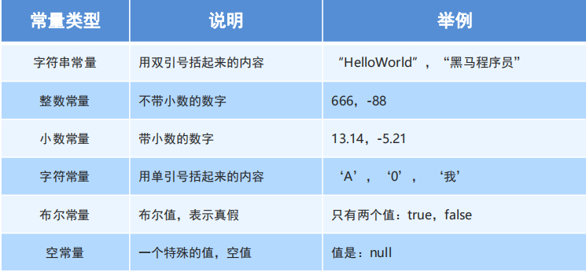

## 变量

就是内存中的一块存储空间，空间中存储着经常发生改变的量（数据）

- 定义变量：`数据类型 变量名 = 数据值;`

**变量的注意事项：**

- 变量名不允许重复定义（在同一作用域范围内）；
- 一条语句可以定义多个变量，但不能定义多个类型；
- 变量在使用之前一定要进行赋值（和 js 不一样，js 会默认赋值 undefined，在 Java 中会编译报错）；
- 定义 float 时要在数值后面加个 F 或 f，定义 long 时要在数值后面加个 L 或 l；
- 变量的作用域范围：
  > 一对大括号括起来的区域叫做一个块；
  > 局部变量的生命周期：从被定义的位置开始，到本块结束；
  >
  > 1. 子块可以访问父块中的变量
  > 2. 父块不能访问子块的变量
  > 3. 子块不能定义与父块同名的变量

## 数据类型

为空间中存储的数据，加入类型限制。

### 计算机数据的存储

计算机的存储设备的最小信息单元叫 “**位（bit）**”，又称之为 “**比特位**”，通常用小写的字母 “b” 表示。

而计算机中最小的存储单元叫 “**字节（byte）**”，通常用大写字母 “B” 表示，字节是由连续的 8 个**位** 组成。

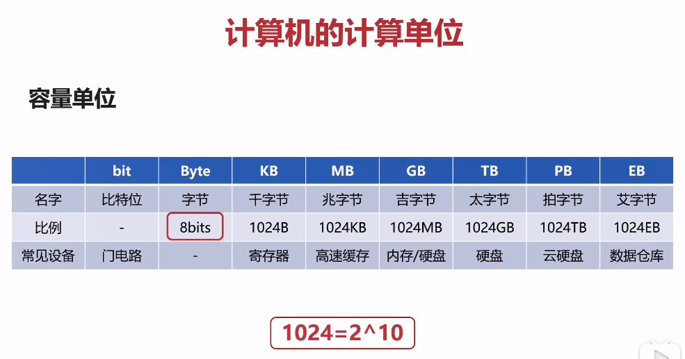

### Java 的数据类型

Java 语言是**强类型**语言，对于每一种数据都给出了明确的数据类型，不同的**数据类型**也分配了不同的**内存空间**，所以它们表示的**数据大小**也是不一样的。

**Ps：**

> JavaScript 是弱语言类型，在定义变量的时候并没有规定变量的类型，而 Java 不一样，在定义变量的时候就必须给出明确的数据类型，以此来获取对应的存储空间。

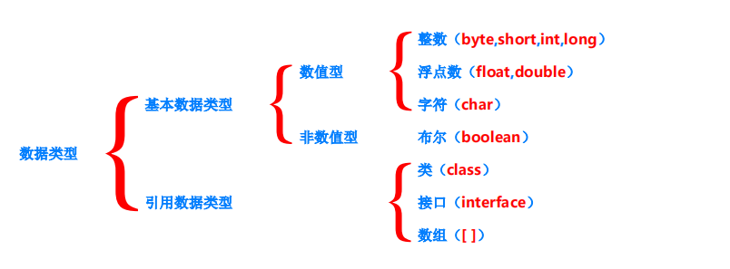

根据上面的树形图可以看到，Java 的数据类型分为 **基本数据类型** 和 **引用数据类型**
基本数据类型又分为**数值型**和**非数值型**

基本数据类型也就有了 **四类八种**

### 数据类型内存占用和取值范围

前面说到，Java 不同的数据类型分配了不同的**内存空间**，下面列出了各个基本数据类型的**内存占用**和**取值范围**：

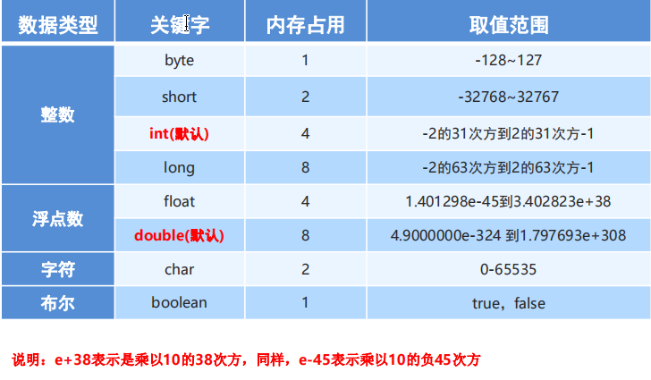

**注意：**

- 所有整数类型（包括整数常量），默认都是 **int**；所有小数类型（包括小数常量），默认都是 **double**。

## 标识符

就是给类，方法，变量等起名字的**符号**。

**命名规则：大驼峰、小驼峰**

## 类型转换

**ps**：在 Java 中不同的数据类型之间运算的规则 较 JavaScript 的运算有较大出入。

类型转换的一个重要点就在于要清楚各个类型的取值范围（**不是指分配内存大小**）

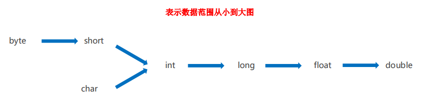

**Ps**：虽然 long 的内存占用为 8 字节，float 的占用为 4 字节，但是浮点数所能代表的取值范围远比整数要大的多，故 float 和 double 都要比其他数值型的类型要大。

### 隐式转换

1. 在 Java 中，小的数据类型可以直接赋值给大的数据类型。

```java
int a = 10;
double b = a; // 正确
```

2. 在 Java 中，如果一个 **取值范围** 小的数据类型和 **取值范围** 大的数据类型运算，Java 会先将小的数据类型转换为大的数据类型，然后进行运算，得到的结果的类型也就是那个 **取值范围** 大的数据类型。

```java
int a = 10;
double b = 12.3;

// 小的数据类型和大的数据类型运算，会先将小的数据类型转换为大的数据类型，然后计算
// 得到的结果为大的数据类型，故这里使用 double 类型接收结果。
double c = a + b;
```

Java 自动去做转换的称为隐式转换。
运算时所做的隐式转换，实际上提升较小类型的类型，故可称为隐式提升。

#### byte short char 的隐式转换

在隐式转换中，需要特别关注：**byte short char** 三种数据在运算的时候，不管是否有更高的数据类型，都会提升为 **int** 然后再进行计算。

```java
byte h = 12;
byte i = 24;

byte j = h + i; // 错误: 不兼容的类型: 从int转换到 byte 可能会有损失

// 可见，明明是两个 byte 类型的数据相加，为什么会报错说 从 int 转换到 byte 呢？
// 就是因为  byte short char 三种数据类型在运算的时候，会隐式提升为 int 数据

// 故，应该使用 int 接收结果
int j = h + i;

System.out.println(j); // 36
```

#### long 类型为什么要在后面加一个 L/l？

**先假设**：在 Java 中，所有的整数（比如赋值时所取的整数常量）都是默认采用 int 容器存储的，所以说所有的整数默认都是 **int** 型的。

**现在尝试证明这个假设：**

**第一步**：已知 byte 的最大值为 127，如果一个 byte 的取值超过 127，会发生什么呢？

```java
 public class Conversion {
	 public static void main(String[] args) {
		 byte a = 129;
		 System.out.println(a);
	 }
 }
```

**结果**：

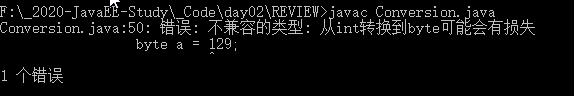

> 它报出的错误为：从 int 转换到 byte 可能会有**损失精度**。
>
> 很奇怪，难道不应该报 数值过大，byte 存储不下之类的吗？
>
> 就像我想往一个装 1 升水的桶里倒了 1.2 升水，你不应该告诉我水太多了，这个桶装不下吗？
> 你却告诉我，从 装 4 升水的桶 往这个 1 升的桶里倒水的时候，可能会装不下。
>
> what ? 哪来的 4 升的桶？

**第二步**：如果一个超出 int 取值范围的整数常量，在 Java 中会发什么：
已知 int 的最大取值范围为：2 的 31 次方 - 1 = **2147483647**;

```java
long ll = 2147483648;
```

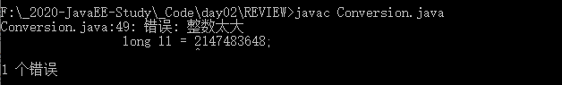

> 错误: **整数太大**
>
> 疑惑，这个数明明没有超过 long 的范围，它却说**整数太大**。
>
> 现在有一个能够装 8 升水的桶，我要往里面倒 4.1 升的水，你却告诉我，水太多了？
>
> 水太多的原因是不是因为：原先这些水是存放在一个装 4 升水的桶里的，但是在存放的时候就发现水已经洒了，所以还没有到 “倒水” 的这一步就已经出现了问题了。

**第三步**：在定义 long 类型的时候，在数值后面加上一个 L/l

```java
long ll = 2147483648L; // 编译通过了
```

> 加了一个 L/l 后编译就通过了，为什么？
>
> 好，之前是因为你也不知道我想要 4.1 升水的，所以你一开始是拿 4 升的桶装的，所以水洒了。
> 现在，我通过一些方式，告诉了你，我需要很多的水，你应该拿最大桶来装，没问题。

**第四步**：如果将一个带有 L/l 的整数常量 赋值给一个 int 类型的变量会发生什么呢：

```java
int ll = 214748364L;
```

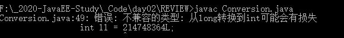

> 在一个整数常量加了一个 **L/l** 后，这个整数类型变成了 long？
>
> 现在，你拿着一个 8 升的桶，告诉我，我要给你一些水，你应该也拿 8 升的桶来装，不然可能会洒出来一部分水。

**Good good study, day day up!**

**得出结论**：

> **在 Java 中所有的整数常量默认都是 int 型的**（采用 int 类型的容器存储）；
>
> 当我们在定义一个其他数值类型的变量时，实际上 Java 是将 int 型的常量转换成 **目标类型**。
> 如果常量的值并未超过目标类型的取值范围，将能够正常定义变量，如果超出类目标类型的取值范围，将会报：**从 int 转为 目标类型可能会损失精度**（如第一步所示）。这样的一个转换是由 Java 完成的，亦可称之为**隐式转换**。
>
> 由于整数常量默认是 int 型的，那么它就有取值范围，一旦常量超过 int 的取值范围，就会报错（**整数太大**）。
> 这时候可以在这个整数后面加一个 **L/l**，那么这个整数常量对于 Java 来说，它就是 long 型的，就会默认采用 long 类型容器存储。所以在将带有 **L/l** 的常量赋值给 int 变量时，会报：**从 long 转换到 int 可能会损失精度**。
>
> 之所以 long 类型后面要带一个 **L/l** 就是为了要告诉 Java，一开始就用 long 存储，我们才能够书写超过 int 取值范围的常量。
>
> 这样从默认的 int 类型转换成 默认的 long 类型，是否也可以称之为发生了 “**隐式转换**” 呢？

### 强制转换

在 Java 中，大的数据类型不能直接赋值给小的数据类型，否则编译报错。
要想将大的数据类型赋值给小的数据类型变量，需要先将大的数据类型变量做一个转换，转换为小的数据类型。

转换的方式为：**`目标数据类型 变量名 = (目标数据类型)值或变量;`**

```java
double f = 22.3;
int g = f; // 错误: 不兼容的类型: 从double转换到int可能会有损失

// 强制转换
int g = (int)f;
System.out.println(g); // 22
```

**注意**：强制类型转换，有可能发生精度损失

**精度损失**：

> 也就是说，如果大类型的数据再向小类型转换时，如果数据本身的大小超出了目标类型的取值范围，那么可能就会丢失一部分的数据。
>
> 比如某个 3 字节的数据，强制转换为 short 数据时，必然会丢失一部分数据；
>
> 就像是将容积为 **8 升**的水，倒入容积为 **4 升**的容器中，如果水超出了 **4 升**，就洒了，如果没超出 **4 升**，大家当无事发生。

应该尽量减少强制转换的使用，应使用**合适的类型**定义变量。

## 运算符

**运算符**：对常量或变量进行操作的符号

**表达式**：用运算符把常量或者变量连接起来，符合 Java 语法的式子就可以称为表达式。
不同运算符连接的表达式体现的是不同类型的表达式。

**所有的表达式都是有返回值的！**

### 算术运算符

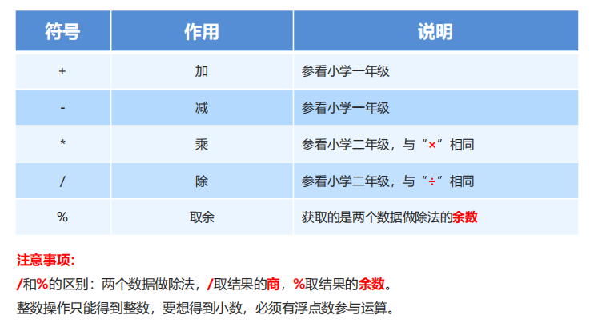

#### 字符的 “+” 操作

在隐式转换一节中，我们知道 byte short char 在运算的时候，无论是否存在更高级别的类型，都会**隐式提升**为 int 型，然后进行运算。

byte short 都是数值型的，提升为 int 后，还是原先的数值。有没有想过，char 是字符，它提升为 int ，是什么样的呢？

**答案**：ASCII 码表

> ASCII (American Standard Code for Information Interchange)：美国信息交换标准代码
> 是计算机中字节到字符的一套对应关系。


**char 提升为 int 的过程，就是查找码表中，字符所对应的数值表示形式**。

而对于 字符的 “**+**” 操作，就是先查找码表中对应的数值，然后进行计算。

```java
char a = 'a';
char b = 'b';
double c = 2;
double res = (a + b) / c;

System.out.println((int)a); // 97
System.out.println((int)b); // 98
System.out.println(res); // 97.5
```

#### 字符串的 “+” 操作

字符串相连操作。

#### 自增自减运算符

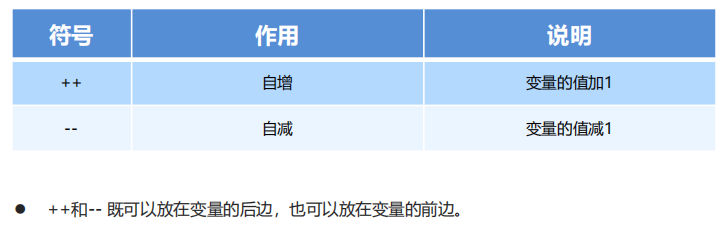

**注意**：

- 单独使用的时候，++ 和 -- 无论是放在变量前边还是后边，结果是一样的。
- 参与操作的时候
  - 如果放在变量的后边，先将**变量原本的值**，取出来参与操作，随后再进行 **自增/自减**
  - 如果放在变量的前边，先对该变量做**自增/自减**，然后在拿变量参与操作。

### 赋值运算符

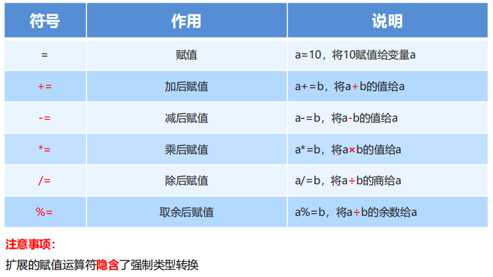

### 关系运算符

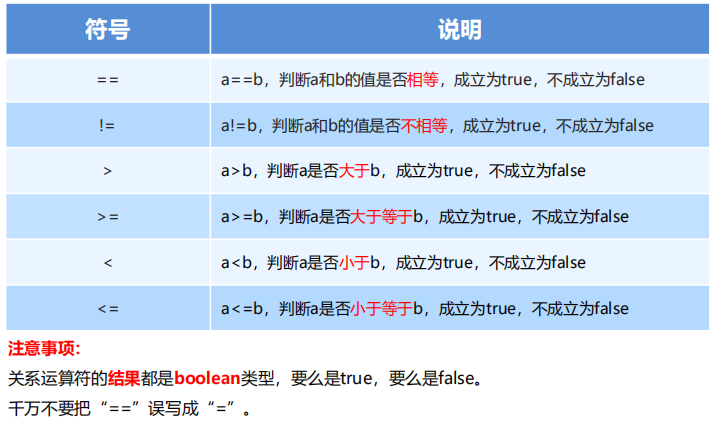

### 逻辑运算符

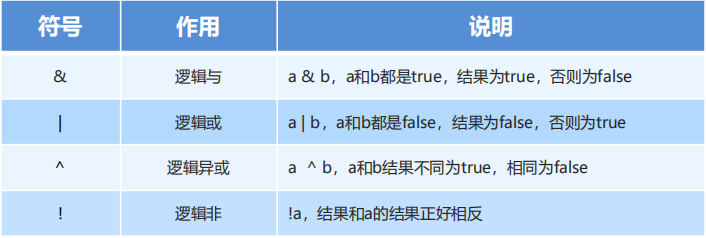

**短路逻辑运算符：**

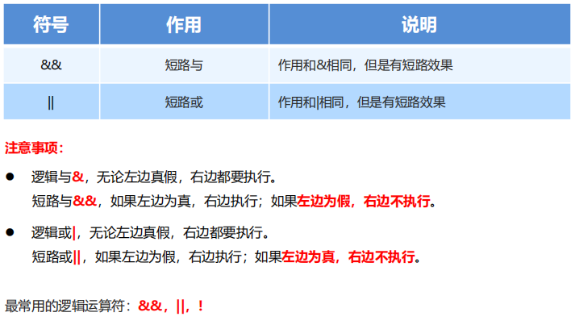

### 三元运算符

格式：**关系表达式 ? 表达式 1 : 表达式 2;**

```java
int a = 10;
int b = 20;

int max = a > b ? a : b;

System.out.println(max); // 20
```

**计算规则**：
首先计算关系表达式的值
如果为 **true** ，返回**表达式 1**
如果为 **false**，返回**表达式 2**

### 注意！注意！注意！

> 在 Java 中，短路逻辑运算符，三元表达式，都不能像在 JavaScript 中直接执行语句

比如：

```javascript
10 < 20 && console.log("happy");

10 > 20 ? consolg.log("yes") : console.log("no");
```

> 以上两个语句在 JavaScript 中都是可以正确执行的。甚至可以用来**代替 if 语句**。
> 之前我常用的一个操作就是用 短路运算符 来代替 if 语句，在 Java 中不可能实现。

但在 Java 中，短路运算符，三元表达式做类似操作（表达式中含有语句）则是**违法**的。

```java
10 < 20 && System.out.println("no");

10 > 20 ? System.out.println("god") : System.out.println("error");
```

## 流程控制

流程控制语句：通过一些语句，来**控制程序**的**执行流程**

### 顺序结构

顺序结构是程序中最简单最基本的流程控制，没有特定的语法结构，按照代码的**先后顺序**，依次执行。
程序中大多数的代码都是这样执行的。

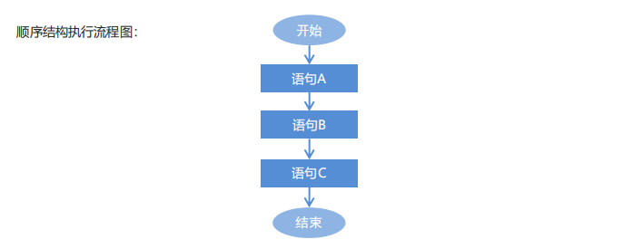

### 分支结构

#### if 语句

偏向于区间的判断

```java
if(关系表达式) {
  语句体1
}
else if(关系表达式2) {
  语句体2
}
....
else {
  语句体n
}
```

#### switch 语句

偏向于固定的选择

- case 后的值不可以重复
- case 后不可书写变量
- switch 语句**可以接受**的数据类型
  - 整数类型除了 long (byte short int)
  - 字符 char
  - 字符串 String

**case 穿透**

某个 case 没有 break，将会一直往下执行，直到遇到下一个 break，或直至 switch 结束。

```java
switch (表达式) {
  case 1:
    语句体1;
  case 2:
    语句体2;
  case 3:
    语句体3;
    break;
}
```

### 循环结构

**循环**：重复做某件事情，具有明确的开始和停止标志。

#### for 循环

```java
for(初始化语句; 条件判断语句; 条件控制语句) {
  循环体;
}

for(int i = 0; i < 10; i ++) {
  System.out.println(i);
}
```

#### while

```java
int i = 1;
while(i <= 100) {
  System.out.print(i + " ");
  i++;
}
```

#### do...while

无论循环条件是否满足，都至少会执行一次循环体。

```java
初始化语句;

do {
  循环体语句;
  条件控制语句;
} while(条件判断语句);


int i = 0;
do {
  System.out.println(i);
  i++;
} while(i < 10);

System.out.println(i);
```

#### 三种循环的区别

- for 循环和 while 循环先判断条件是否成立，然后决定是否执行循环体（先判断后执行）
- do...while 循环先执行一次循环体，然后判断条件是否成立，是否继续执行循环体（先执行后判断）

**for 和 while 的区别**

- 条件控制语句所控制的自增变量，因为归属 for 循环的语法结构中，在 for 循环结束后，就不能再次被访问到了
- 条件控制语句所控制的自增变量，对于 while 循环来说不归属其语法结构中，在 while 循环结束后，该变量还可以继续使用

#### 跳转控制语句

- continue：用在循环中，结合条件控制，跳过此次循环
- break：用在循环中，结合条件控制，结束当前所在循环

GOTO 语句
