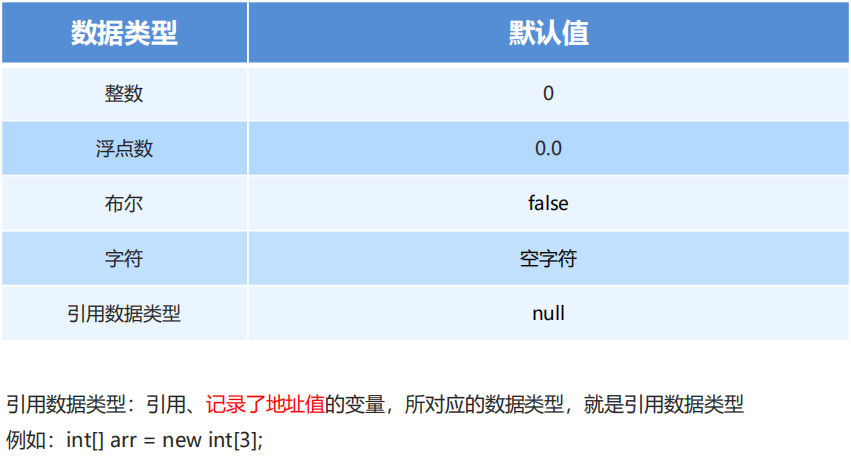
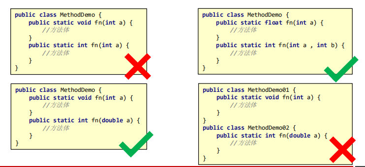
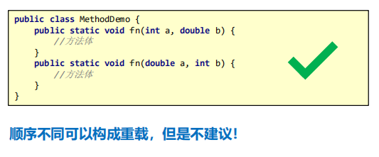
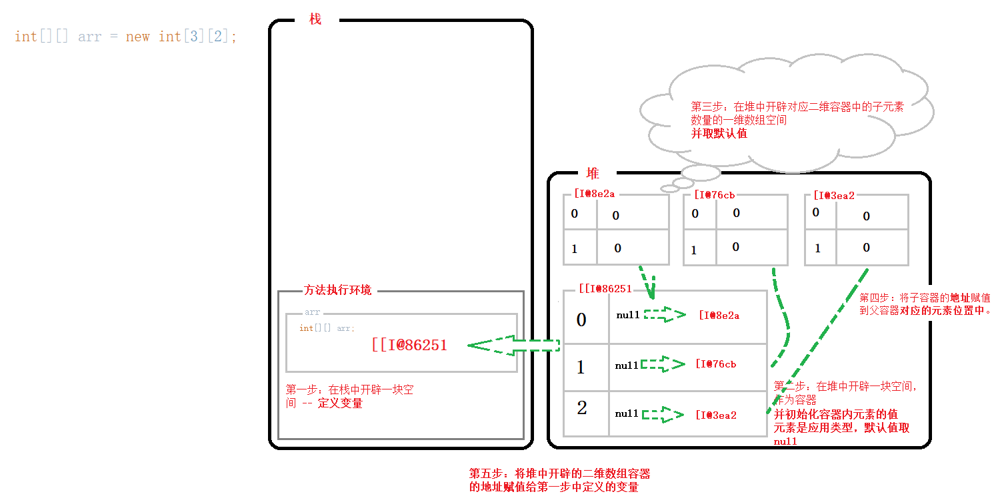

# Java 基础语法 2

## 数组 array

**变量**：用来存储数据，但是一次只能存一个数据，存储多个数据需要定义很多变量

**数组(Array)**：一种**容器**，用来存储**同种数据类型**的多个值。

> Java 中的数组是用来存储同种数据类型的，不同于 JavaScript。
> JavaScript 数组啥都能存。

**定义**：

1. 数据类型[] 数组名 = **创建数组容器**;
   - `int[] arr;`
   - 创建一个 存储的数据是 int 类型的数组（[] 表示数组）, 数组名字叫 arr.
2. 数据类型 数组名[] = **创建数组容器**;
   - `int arr[];`
   - 创建一个 名字叫 arr 的数组，存储的数据类型是 int 类型.

**注意**：

直接打印数组变量的时候，打印出的是数组的内存地址：**[I@506e1b77**

> **@**：分割符
> **[**：当前的空间是一个数组类型
> **I**：当前数组容器中所存储的数据类型（I、B、C...）
> **506e1b77**：十六进制内存地址

---

> 在一个数组定义之后，未初始化之前，这一步的操作实际上是在 栈内存中开辟了一个变量，用于存放即将创建的数组容器，在**堆**中的**地址**。
>
> 即：如果定义的数组没有初始化，那么它就是一个数组变量，没有存放**地址**的变量。

### 初始化之动态初始化

**初始化：**

Java 中的数组必须先**初始化**，然后才能使用；

所谓**初始化**：就是在内存中，为数组容器**开辟空间**，并将数据**存入容器**的过程

**动态初始化：**

初始化的时候，只**指定数组长度**，由**系统**为数组**分配初始值**。

**格式**：

- 数据类型[] 变量名 = new 数据类型[数组长度]
  - `int[] arr = new int[5];`

**各类型默认初始化值：**



### 数组元素访问

已知在定义数组的时候，变量所存储的其实是 数组容器在内存中的地址

- 数组内存地址的访问方式
  - 格式：数组名

要获取数组容器中的数字，需要使用索引。

- 数组内部保存的数据访问方式
  - 格式：数组名[索引]

索引是数组中空间的编号：

- 索引从 0 开始
- 索引是连续的
- 索引是逐一增加，每次加 1

### Java 内存分配

Java 程序在运行时，需要对内存中分配空间

为了提高运算效率，就对空间进行了不同区域的划分

每一片区域都有特定的处理数据方式和内存管理方式

**Java 中内存分配**

- 栈内存

  > 方法运行时，进入的内存，局部变量都存放于这块内存当中

- 堆内存

  > new 出来的内容都会进入堆内存，并且会存在地址值

- 方法区

  > 字节码文件（.class 文件）加载时进入的内存

- 本地方法栈

  > 调用操作系统相关资源

- 寄存器

  > 交给 CPU 去使用

### 静态初始化

初始化时，就可以指定数组要存储的元素，系统还会自动计算出该数组长度。

- 格式：数据类型[] 变量名 = new 数据类型[] {数据 1, 数据 2, 数据 3, ...};

  > `int[] arr = new int[]{11, 22, 33};`

- 简化格式：数据类型[] 变量名 = {数据 1, 数据 2, 数据 3, ...};
  > `int arr[] = {44, 55, 66};`
  > 注意：**不能拆开写**

### 数组的两个常见小问题

- **索引越界**：访问了数组中不存在的索引对应的元素，造成索引越界问题
- **空指针异常**：访问的数组已经不再指向堆内存的数据，造成空指针异常

  > 造成空指针（在 Java 中没有指针的概念，替换的是引用的概念）的原因：
  > 就是本来存储**引用类型数据**的**引用地址**的**变量**，**丢失了**该引用数据的地址，在丢失之后，想要再次获取原引用数据(比如数组)中的元素，就会造成**空指针异常**的错误。
  >
  > 变量丢失引用地址：就是将 **null** 赋值给了该变量。

- **null**：空值，引用数据类型的默认值，表示不指向任何有效对象
  > 在 JavaScript 中，null 是一种特殊的数据类型，它表示空的对象；
  > 在 JavaScript 中，null 常用于定义一个空对象，或清空一个对象。

## 方法 method

就是一段具有独立功能的代码块，不调用就不执行。

提高代码的**复用性**

> JavaScript 中的函数。

- 方法必须先创建才可以使用，该过程称为方法定义
- 方法创建后并不是直接运行的，需要手动使用后才执行，该过程称为方法调用。

### 方法定义

- 格式：

  ```java
  public static void 方法名() {
    // 方法体
  }
  ```

- 范例

  ```java
  public static void eat() {
    // 方法体
  }
  ```

方法与方法之间是平级关系，不能嵌套定义。

- 方法在**没有被调用**的时候，都在**方法区**中的字节码文件(.class)中存储
- 方法**被调用**的时候，需要进入的**栈内存**中运行

### 参数

方法在定义的时候，参数中的**数据类型**与**变量名**都不能缺少，缺少任意一个程序将报错

方法定义是，多个参数之间使用 逗号 (,) 分隔

- 格式

  ```java
  public static void 方法名(参数) {....}
  ```

- 格式(单个参数)：

  ```java
  public static void 方法名(数据类型 变量名) {...}

  // 范例
  public static void method(int number) {...}
  ```

- 格式(多个参数)：

  ```java
  public static void 方法名(数据类型 变量名1, 数据类型 变量名2, ...) {...}

  // 范例
  public static void getMax(int num1, int num2) {...}
  ```

**形参**：全称形式参数，是指方法**定义**中的参数

**实参**：全称实际参数，方法**调用**时给的参数

#### 基本数据类型参数

在传递参数的时候，如果传递的是基本类型的数据，实则传递的是变量所存储的那个**具体值**

> **按值传递**

#### 引用数据类型参数

按值传递，传递**内存引用地址的拷贝**。

> 和 Js 一样

### 返回值

为什要有带返回值的方法：

我们经常会根据一个方法产出的结果，来去组织另外一段代码逻辑；
为了拿到这个方法产生的结果，就需要定义带有返回值的方法。

> 因为所谓的方法实际上就相当于一个工具，有些方法的功能我们可能是要用它来处理一些数据，然后将处理的结果再给我们，这个时候，就需要用到返回值。

- 格式
  ```java
  public static 数据类型 方法名(参数) {
    return 数据;
  }
  ```
- 范例

  ```java
  public static boolean isEvenNumber(int number) {
    return true;
  }
  ```

**注意**：
方法定义是 **return** 后面的返回值与方法定义上的**数据类型**要匹配，否则程序报错
return 只能返回**一个**结果，否则语法错误

可以返回一个**容器**，装载**多个数据**（Js 中多采用返回一个 Object，承载多条数据）。

**PS**：

> 在 Java 中，无处不在的数据类型，**强类型语言**...

### 方法的通用格式

```java
public static 返回值类型 方法名(参数) {
  方法体;
  return 数据;
}
```

- **public static**：修饰符
- **返回值类型**：方法操作完毕之后返回的 结果数据 所对应的数据类型
  - 如果方法执行完毕，没有数据要返回，这里写 **void**，且方法体中一般不写 **return**
- **方法名**：调用方法时候使用的标识
- **参数**：由数据类型和变量名组成，多个参数之间用逗号隔开
- **方法体**：完成功能的代码块
- **return**：如果方法操作完毕，有数据返回，用于把数据返回给调用者

**方法定义的两个明确**：

- **明确返回值类型**：看方法执行完毕得到什么结果
- **明确形参列表**：方法体要执行对应的功能需要哪些数据支持

### 方法的注意事项

- 方法不能嵌套定义
- 方法的返回类型为 void，表示该方法没有返回值，没有返回值的方法可以省略 **return** 语句不写

  - 如果要写 **return**，后面不能跟具体的数据.（使用 void 修饰的 方法，内部可以写 renturn 终止方法的执行，但是 return 后面不可以跟具体的数据）

- return 语句下面，不能编写代码，因为永远执行不到，属于无效代码。
- 方法调用时，传递的实参的格式和数据类型要与方法定义位置的形参个数及数据类型一致。
  - > Java 中的形参和实参数量必须一致。
    > Js 中形参和实参的个数可以不一致。

### 小结

```java
public class DefineMethod {
    public static void main(String[] args) {
        int sum = getSum(10, 20, 30);
        System.out.println("sum = " + sum);
    }

    /*
     *
     * 在 Java 中，方法的定义就是JavaScript 中的函数
     *   不像 js 中的函数，普通调用叫函数，对象中的属性函数叫方法
     *
     * Java 中定义方法需要在类中去定义，类 == 模块
     *
     * 定义格式：
     *   public static void add() {...}
     *
     * 参数：与 JS 参数概念一致，不同的是定义参数的格式，需要加上类型
     *   public static void add(int a, int b) {...}
     *
     * 返回值：概念一致，方式不一样
     * 在 Java 中无时无刻不存在着 数据类型的概念，返回值的定义也是如此
     * 在定义一个带有返回值的方法时，不在使用 void 关键字，替换的则是 这个方法返回值的数据类型
     *   public static int getSum(int a, int b) {
     *       return a + b;
     *   }
     *
     *   int sum = getSum(10, 20);
     *
     * 需要特别注意的一点：
     *  一个方法的返回值，在接收的时候可以使用比返回值类型更大的类型接收
     *  反之，则报错
     *
     * 还有一点：
     *  当一个方法中出现了 return 后，就说明这个方法的执行结束了，执行环境出栈（弹栈）
     *  理论上是这样的，在实际编写代码中，如果 return 后面还有语句，编译将会报错
     *  “无法访问的语句”
     * */

    public static int getSum(int a, int b, int c) {
        return a + b + c;
    }
}
```

### 方法重载

方法重载指的的方法与方法的**关系**。

在同一个类中，定义了多个**同名的方法**，但每个方法具有**不同参数类型**或**参数个数**，这些同名的方法，就构成了重载关系。

- **同一个类中**，方法名相同，参数不同的方法

  - 参数不同：个数不同、类型不同、顺序不同

注意：识别方法之间是否是重载关系，只看方法名和参数，跟**返回值无关**。

```java
// 还有这骚操作？

public class Reload {
    public static void main(String[] args) {
        int two = sum(10, 20);
        int there = sum(22, 44, 55);

        System.out.println("two = " + two);
        System.out.println("there = " + there);
    }

    public static int sum(int a, int b) {
        return a + b;
    }

    public static int sum(int a, int b, int c) {
        return a + b + c;
    }
}
```



**当两个方法中的参数顺序不同时，也可以构成重载**



---

**白话**：

> 目前看来，方法的重载是为了解决参数数据类型不同，但需要相同处理逻辑的问题。
>
> 也就是说，有一段固定的逻辑代码，封装成方法后，由于可能需要接收到不同的数据类型，但是 Java 又不像 Js 那样没有类型限制，在定义的时候就需要限制数据类型，虽然可以通过定义 n 个不同的方法来接收不同的数据，但也造成了方法名过多的问题，导致代码混乱。
>
> 代码重载的功能就是同一个名字的方法，jvm 可以通过识别参数的不同，继而调用不同的方法。

**Ps：**

> 最近一直使用的 `System.out.println();` 这个方法，在每次打印的时候，可以接受不同类型的参数，在 Js 中一个方法接受不同类型的参数，这属于**正常操作**。
>
> 但在 Java 中，仔细一想，一个方法在定义的时候就要确定可接收的参数的**类型**了，那么 **println**是如何在调用的时候**接收不同的参数**的呢？
>
> 其实使用的就是**重载**的特性。

---

#### 方法重载参数的匹配规则

## 二维数组

二维数组也是一种**容器**，不同于一维数组，该容器存储的都是一维数组容器。

二维数组中，元素所存储的是一维数组的**地址**。

> Java 中的容器都是数组吗？
> 在 Js 中，还有对象格式的容器

**定义格式**

- **格式 1**：`数据类型[][] 变量名;`

  > `int[][] arr;`

- 格式 2：`数据类型 变量名[][];`

  > `int arr[][];`

- 格式 3：`数据类型[] 变量名[];`

  > `int[] arr[];`

### 动态初始化

格式：`数据类型[][] 变量名 = new 数据类型[m][n];`

> m 表示这个二维数组，可以存放多少个一维数组
> n 表示每一个一维数组，可以存放多少个元素

```java
// 二维数组 动态初始化
int[][] arr = new int[3][8];

/*
* [[I@79fc0f2f
* @：分隔符
* 79fc0f2f：十六进制内存地址
* I：数组中存储的数据类型
* [[：几个中括号就代表是几维数组
*
* */
System.out.println("arr = " + arr); // [[I@79fc0f2f

```

### 二维数组的内存分配过程

```java

/*
  * 在创建一个一维数组的时候，分为三步：
  *   第一步：在栈中开辟一块空间，将用来存储数组的地址
  *   第二步：在堆中开辟一块空间，作为容器
  *   第三步：将堆中所开辟空间的地址 赋值给 栈中的变量
  * */

int[] arr;
arr = new int[3];

/*
  * 二维数组：
  *   第一步：在栈中开辟一块空间，将用来存储二维数组的地址
  *   第二步：在堆中开辟一块空间，作为容器
  *               并初始化值 - 由于 二维数组所存储的是一维数组，引用数据类型的默认值都是null
  *   第三步：根据定义，在内存中开辟对应的 m 块空间，作为子容器
  *               根据一维数组的默认取值规则，初始化一维数组的数据
  *   第四步：将那 m 块子容器的地址，赋值给父容器中的对应的位置
  *   第五步：将 父容器 的引用地址，赋值给第一步栈中所开辟的变量空间
  * */

int[][] twoArr;
twoArr = new int[3][3];

```



### 静态初始化

格式：`数据类型[][] 变量名 = new 数据类型[][]{{元素 1, 元素 2...}, {元素 1, 元素 2...}...}`

```java

int[][] arr2 = new int[][]{{1, 2, 3}, {4, 5, 6}, {7, 8, 9, 4}};

// 简化格式
int[] arr3[] = {{11, 22, 33}, {44, 55, 66}};
```

## 集合

提供一种**存储空间可变**的存储模型，存储的数据容量可以发生改变

集合和数组的区别：

- 共同点：都是存储数据的容器
- 不同点：数组的容量是**固定**的，集合的容量是**可变**的

Ps

> 我一直以为 Java 的数组和 Js 的数组一样，要添加元素 使用 数组提供的方法即可（比如 push、shift...），原来数组的长度是固定的，集合才是可以扩容的容器
