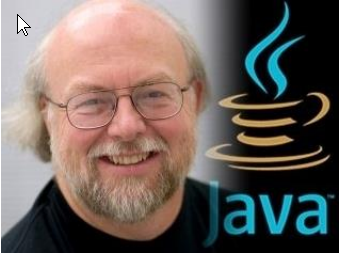
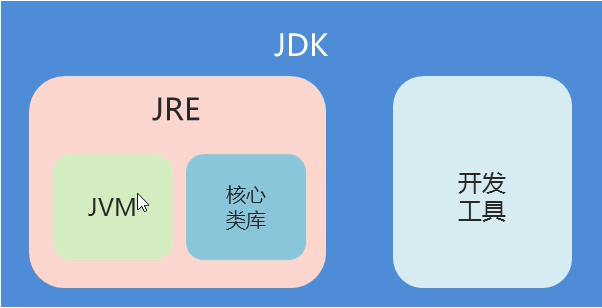
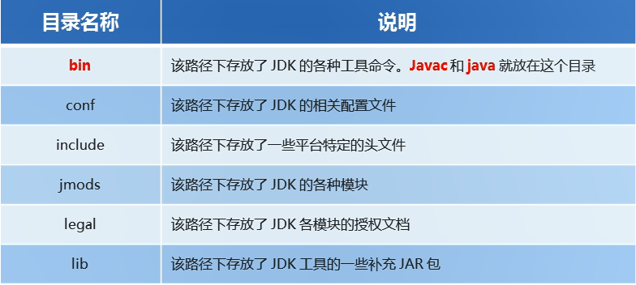
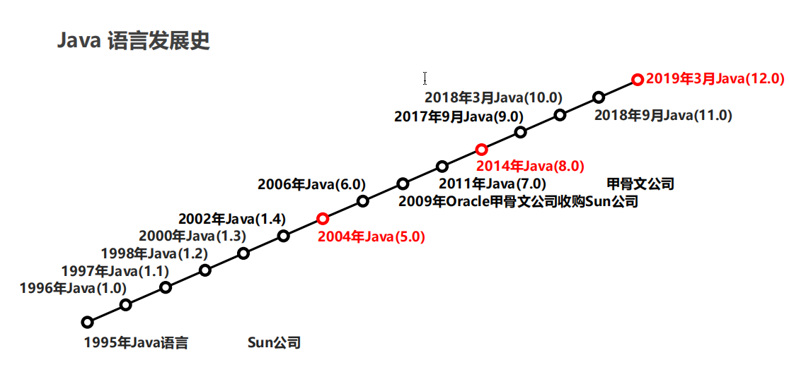

# Java 概述

## Java 背景

Java 语言是美国 Sun 公司（Stanford University Network）在 **1995** 年推出的计算机语言。
Java 之父：詹姆斯·高斯林（James Gosling）。


## Java 语言版本

Java 语言的三个版本

- JavaSE

  > Java 语言的基础部分：基础语法及 **API**;
  > 可以用来做桌面应用，需要额外学习 **GUI**。如果需要做华丽的界面，很耗费性能;
  > 如果舍弃华丽界面（丑），所以不太实用（但是可以做）

- JavaME

  > 小型嵌入式设备，凉了，被安卓和 IOS 取代;
  > 就是以前的山寨机里面的应用

- JavaEE
  > 网站开发，企业级应用;
  > 服务器开发龙头语言

Java 是可以跨平台的，跨平台是因为 JVM 虚拟机，而 JVM 虚拟机本身是不可以跨平台的。

## JDK

### 1. JDK 的概念

Java 程序开发分为三个阶段

> **编写代码、编译代码、运行代码**

在开发 Java 程序的时候，最重要的东西就是 JDK，暂且统称为 JDK

JDK 又分为 JRE、JDK

- **JRE（Java Runtime Environment）**

  > 顾名思义，Java 运行环境
  > 它包括了 **JVM** 虚拟机，及 Java **核心类库（Java API）**

- **JDK（Java Development Kit）**

  > Java 开发工具包
  > 它提供了编译(**javac**) Java 源代码（**.java** 文件），运行(**java**) Java 编译后的文件（**.class** 文件） 等一系列的工具

  **三者的关系：**
  

### 2. JDK 的下载 & 安装

Oracle 官网下载，傻瓜式安装

**安装文件夹目录详解：**


安装完成后就是配置环境变量

### 3. Java 语言发展史

在 JRE 中，包含了 Java 语言的**核心类库**，JDK 的版本更新也就携带了 JRE 核心版本库的更新，也就对应了 Java 的发展史。


- 重点关注：

  - Java 5 是里程碑性质的版本
  - Java 7 是 Oracle 公司收购后发布的第一个版本
  - Java 8 是企业中用的最多的，也是最稳定的版本

## HelloWorld

Java 语言版的 HelloWorld

```java
public class HelloWorld {
	public static void main(String[] args) {
		System.out.println("JavaScript 是世界上最好的语言");
	}
}
```
