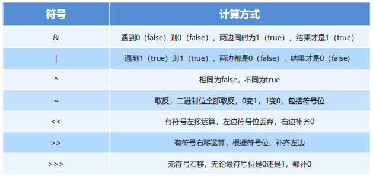

# 进制

指进位制，是人们规定的一种进位方式

表示某一位置上的数，运算时是逢 X 进一位

十进制是逢十进一，二进制就是逢二进一，八进制是逢八进一...

**常见进制**：二进制，八进制，十进制，十六进制

```java
/*
* 在 Java 代码中，书写数值的时候都以十进制写的
* 也可以书写其他进制的数值
*
* 数值在 Java 代码中的 各进制表示方式：
* 二进制：0b101         - 二进制以 0b 开头
* 八进制：012           - 八进制以 0  开头
* 十六进制：0x1ca       - 十六进制以 0x 开头
* */

System.out.println("10 = " + 10);
System.out.println("0b101 = " + 0b101); // 5
System.out.println("02310 = " + 02310); // 1224
System.out.println("0x2cea = " + 0x2cea); // 11498

```

## 二进制

二进制数据使用 **0 和 1 两个数码** 来表示。

例如：0101000

进位规则是 “逢二进一”，借位规则是 “借一当二”。

## 八进制

八进制采用 **0, 1, 2, 3, 4, 5, 6, 7** 八个数字。

逢八进一

## 十六进制

用数字 0 到 9 和字符 A 到 F (或 a~f)表示，其中 A~F 表示 10 ~ 15

**0, 1, 2, 3, 4, 5, 6, 7, 8, 9, a, b, c, d, e, f**

## 进制转换

### 任意进制到十进制的转换

- 公式：**系数 \* 基数的权次幂**相加
  - **系数**：每一【位】上的数
  - **基数**：几进制，就是几
  - **权**：从数值的右侧，以 0 开始，逐个+1 增加

**如下，二进制转十进制**：

```java
// 二进制
1100110

0 * 2 ^ 0 = 0
1 * 2 ^ 1 = 2
1 * 2 ^ 2 = 4
0 * 2 ^ 3 = 0
0 * 2 ^ 4 = 0
1 * 2 ^ 5 = 32
1 * 2 ^ 6 = 64

0 + 2 + 4 + 0 + 0 + 32 + 64 = 102


// 公式是通用的，十进制，基数就是10。拆解十进制数
142568

8 * 10 ^ 0 = 8
6 * 10 ^ 1 = 60
5 * 10 ^ 2 = 500
2 * 10 ^ 3 = 2000
4 * 10 ^ 4 = 40000
1 * 10 ^ 5 = 100000

8 + 60 + 500 + 2000 + 40000 + 100000 = 142568
```

### 十进制到任意进制的转换

- 公式：**除基取余**
  - 使用源数据，不断的**除以基数**(几进制，基数就是几)**得到余数，直到商为 0**，再将**余数倒着拼起来**即可。

```java
// 十进制数 26 转二进制

26 / 2 (商) 13  余 0
13 / 2 (商) 6   余 1
6  / 2 (商) 3   余 0
3  / 2 (商) 1   余 1
1  / 2 (商) 0   余 1

// 倒着拼装，得到 26 的 二进制数据
11010
```

### 二进制快速转八进制

八进制：将**三个二进制位**看为**一组**，再进行转换

原因：八进制逢八进一，三个二进制位最多可以表示 111，也就是数值 7，如果出现第四位，就超范围了

```java
// 二进制
010100111101

// 转八进制，三位为一组
101 = 5
111 = 7
100 = 4
010 = 2

// 最后得到：
2475

// 八转十
5 * 8 ^ 0 = 5
7 * 8 ^ 1 = 56
4 * 8 ^ 2 = 256
2 * 8 ^ 3 = 1024

5 + 56 + 256 + 1024 = 1341
```

### 二进制快速转十六进制

十六进制：将**四个二进制**看为**一组**，再进行转换

原因：十六进制逢十六进一，四个二进制最多可以表示 1111，也就是数值 15，如果出现第五位，就超出范围了

```java

// 二进制
111100

1100 = c
0011 = 3

// 十六进制
3c

```

## 原码反码补码

计算中的数据，都是以二进制补码的形式在运算，而补码则是通过**反码和原码推算出来**的。

- **原码**（看数据）：可直观看出数据大小

  > 就是二进制**定点表示**法，即最高位为符号位，**【0】表示正，【1】表示负**，其余位表示数值的大小。

- **反码**（转数据）：为了原码和补码之间做转换的媒介

  > 整数的反码与其原码相同；负数的反码是对其原码逐位取反，但符号位除外

- **补码**（运算数据）：数据都是以补码进行运算的

  > 正数的补码与其原码相同；负数的补码是其反码的末位加 1。

正数的原反补都是**相同**的

负数的 **【反码】**，是根据 **【原码】**取反（0 变 1，1 变 0）得到的（符号位不变）

负数的 **【补码】**，是根据 **【反码】** 的末尾 +1，得到的。

```java
/*
  *
  * 当给定一个二进制数时，如果没有特别注明这个数是原码，那么它就是一个单纯的二进制数
  * 如果注明是原码的话，那么最高位是一个符号位
  *
  * 符号位：0 代表正，1 代表负
  * 反码：在原码的基础上，每位取反（符号除外）
  *   0 -> 1
  *   1 -> 0
  *
  * 补码获取：在反码的基础上，末尾 +1
  *
  * 原码：1001 0110
  * 反码：1110 1001
  *             +1
  * ---------------
  * 补码：1110 1010
  *
  * ========================================
  *
  * 补码转反码：末尾减 1
  * 给定一个补码求原码：
  *
  * 补码：1001 0111
  *             -1
  * ---------------
  * 反码：1001 0110
  * 原码：1110 1001
  *
  * */
```

## 位运算

位运算符指的是**二进制位**的**运算**，先将十进制转成二进制后再进行运算。

在二进制位运算中：**1 表示 true, 0 表示 false**

**位运算符：**


