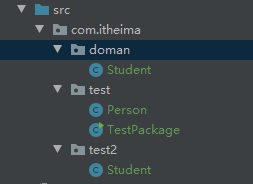

# Java 进阶

## 包

如果将所有的类文件都放在同一个包下，不利于管理和后期维护

对于不同功能的类文件，可以放在不同的包下进行管理

**包**：本质上就是**文件夹**

### 包的定义

- 使用 **package** 关键字定义包
- 格式：**`package 包名;`** 如果是多级包，中间用 "." 进行分割

> 在类文件中需要声明其所在的包
>
> **package** 关键字定义（标识）当前文件是属于哪个包的

### 包的注意事项

- **package** 语句必须是程序的第一条**可执行**的代码
- **package** 语句在一个 java 文件中**只能有一个**
- 如果没有 **package**，默认表示无包名

### 类与类之间的访问

- 同一个包下的访问

  > 不需要导包

- 不同包下的访问
  1. import 导包后访问
  2. 通过**全类名**(包名 + 类名) 访问
     > 使用场景：多个包下，出现了重名的类，可以使用这种方式进行区分

> 类的导入就像 js 中模块的导入。

**Demo：**



```java
// 项目结构如上图
package com.itheima.test;

import com.itheima.doman.Student;
//import com.itheima.test2.Student; // 报错，同名的类即使包不同，也不允许二次导入

public class TestPackage {
    public static void main(String[] args) {
        /*
         * 不同包下的类，使用的时候，使用 import 进行导入
         * */
        Student stu = new Student();
        System.out.println("stu = " + stu);

        /*
         * 同一包下的类，在使用的时候不需要导包
         * */
        Person Jack = new Person("Jack", 24);
        System.out.println("Jack name = " + Jack.getName());

        /*
         *
         * 同一个名字不同包下的类，只允许导入一个
         * 如果要访问第二个同名字的类，则可以使用 全类名的形式
         *   全类名：包名.类名
         * */
        com.itheima.test2.Student stu2 = new com.itheima.test2.Student();
        System.out.println("stu2 = " + stu2);
    }
}
```

## static 关键字

**static** 关键字是静态的意思，是 Java 中的一个**修饰符**，可以修饰**成员方法、成员变量**

- 被 static 修饰的成员变量，一般叫做静态变量
- 被 static 修饰的成员方法，一般叫做静态方法

**static** 修饰的特点

1. 被 static 修饰的成员，会被该类的所有对象所**共享**
2. 被 static 修饰的成员，会随着类的加载（字节码在方法区的加载）而加载，**优先于对象**存在
3. **多了**一种调用方式，可以通过 **类名.成员** 进行调用

**Person.java**

```java
package staticTest;

public class Person {
    String name;
    int age;
    static String school; // static 修饰为 静态属性

    public Person(String name, int age) {
        this.name = name;
        this.age = age;
    }

    public Person() {
    }

    public void show() {
        System.out.println("name：" + name + ", age：" + age + ", school：" + school);
    }
}
```

**PersonTest.java**

```java
package staticTest;

public class PersonTest {
    public static void main(String[] args) {
        Person Jack = new Person();
        /*
         * 没有使用 private 修饰的成员，可以在类外访问
         * */
        Jack.name = "Jack";
        Jack.age = 18;
        Jack.school = "黑马程序员";
        Jack.show(); // name：Jack, age：18, school：黑马程序员

        Person Rows = new Person();
        Rows.show(); // name：null, age：0, school：黑马程序员

        System.out.println("-----------------------");
        Rows.name = "Rows";
        Rows.age = 20;
        Rows.school = "传智专修学院";

        Jack.show(); // name：Jack, age：18, school：传智专修学院
        Rows.show(); // name：Rows, age：20, school：传智专修学院


        /*
         * 在类中，成员使用 static 修饰后，就变成了静态属性、静态方法
         *   在 Js 中，构造函数的静态属性、方法，只能通过 函数.属性 的方式进行添加
         *   且，实例无法访问静态属性、方法
         *   静态属性、方法只能使用 函数.属性名 的方式进行访问
         *   es6 的 class 的实例、静态属性的定义有所改变
         *
         * Java 中，静态属性使用 static 修饰
         *   静态属性是被所有的实例共享的，也就是说，所有的实例都可以访问静态属性
         *   静态属性除了 实例.属性名 的方式访问外，还可以使用 类.属性名 的方式进行访问
         *
         * */
        System.out.println("静态属性访问：");
        System.out.println("Person.school = " + Person.school); // 传智专修学院
    }
}

```

**Ps**:

> static 修饰的静态属性的一个关键特性是所有的**实例共享**的，且可以通过 实例. 的方式进行访问
>
> 静态属性本质上是**属于类**的，只不过实例可以访问

### static 注意事项

- **静态方法**中，**只能访问**静态成员（静态属性、静态方法）

  > 静态方法会随着类的加载而加载，**优先于**对象存在
  >
  > 非静态需要在**创建对象**后，才可以使用
  >
  > 在静态中使用非静态的话，非静态还不存在，无法使用

- **非静态方法**中，可以使用静态成员，也可以使用**非**静态成员

  > 非静态存在的时候，静态成员**已经存在**了

- **静态方法**中，**没有 this** 关键字
  > this 关键字代表**实例的引用**
  >
  > 静态加载的时候还没有实例，没有 this 指向

**简而言之：**

> **静态成员**无法访问实例成员，因为静态成员存在的时候实例成员**还不存在**
>
> **实例成员**可以访问静态成员，因为实例成员存在的时候静态成员**已经存在**了
