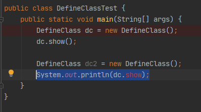
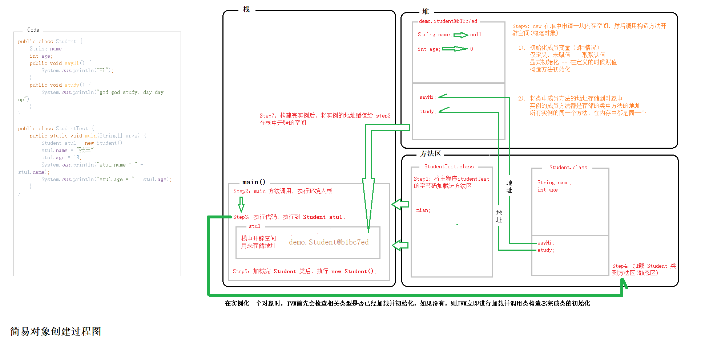
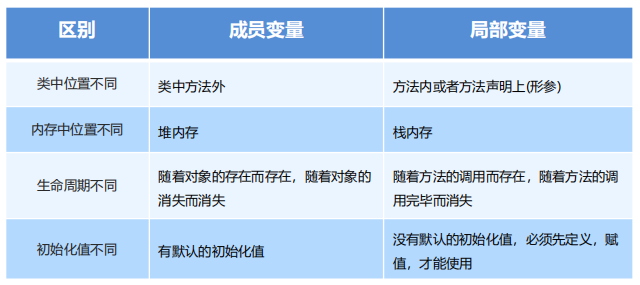

# 面向对象基础


---

面向对象是一种**编程思想**

所谓的**编程思想**，就是指经过了很长的时间，经过很多的人使用，经过实践，总结出来的**编程方法**

一种经过历史长河，并被大多数人所认可的**编程方法**

当然，你也可以不使用编程方法，但是，已经有前人走过的路，何乐而不为呢

我所知道的编程思想有：**面向过程、面向对象、函数式编程**

---

人类生活中，人们总是习惯使用工具或委托别人去实现自己的目的，而这些工具、其他人、万事万物，都可以称之为**目标对象**。

我们串联目标对象来完成目标，解决问题的这种方式，也就是**面向对象**解决问题。

我们所做的程序本来就是用来解决人类生活中的问题的，既然人类本身就是基于**面向对象**解决问题的，那么面向对象的思想同样可以带入到程序中。

从代码编写角度来说，我们在开发的过程中，使用一个个工具去解决我们的问题，这一个个工具的使用，就让我们从执行者的位置，变成了指挥者。

---

**概述**

**面向过程 - POP(Procdefure Oriented Programming)**

> 是一种以**过程**为中心的编程思想，实现功能的每一步，都是自己实现的

**面向对象 - OOP(Object Oriented Programming)**

> 是一种以**对象**为中心的编程思想，通过指挥对象实现具体的功能
>
> > 客观存在的任何一种事物，都可以看做为程序中的对象
> > 使用面向对象思想可以将复杂的问题简单化
> > 将我们从执行者的位置，变成了**指挥者**

## 类和对象

**类**：是现实生活中一类具有共同属性和行为的事物的抽象

> 是对事物，也就是对象的一种描述，可以将类理解为一张设计图
> 根据设计图，可以创建出具体存在的事物

Ps

> 在 Java 中，类的概念不能等同于 Js 的模块，虽然都是以一个文件的形式存在的.
> Java 等同于 Js 的构造函数.

```java
/*
 *
 * 对象的概念（在代码中的概念）：
 *
 * 在 JS 中，对象的概念更像是一个数据容器，一种集合；
 *
 * 客观存在的事物，都可以称作对象
 *
 * 如果我们将这个客观存在的事物 代入到代码中
 * 我们就要从数据的角度出发：
 *       一个客观事物都有它自己的属性，功能
 *       我们将它的属性，功能，抽象成数据的存在
 *       就可以使用 对象 来存储这样一个事物的数据
 *
 * 对象也就是用来存储一组具有关联性的数据的
 *       所谓的关联性，也就是指，数据可能是描述的是同一个事物
 *       也可以理解为，这些数据的产生源头都来自于同一个，或相似的地方
 *
 *   比如：
 *       我们在描述一个人的时候，可能会产生以下数据
 *           身高
 *           体重
 *           年龄
 *           爱好
 *           技能...
 *
 *       我们在存储这样一类数据的时候，就可以使用 “对象” 的形式
 *       这样一来，描述同一件事物的数据就被整合在了一起
 *
 * 总结这样一个过程就是：
 *      将一个具体存在的事物，做成数据，存储于 “对象” 容器中
 *
 * 以上是对于具体事物到对象的一个过程
 *
 * 如果我们反过来，一个 “对象” 可以干什么
 *      “对象” 可以存储数据
 *      理想情况下，所存储数据都是具有关联性的，可以用来描述一个具体的事物
 *      “对象” 不仅可以存储数据，还能包含必要的功能
 * ------------------------------------------------------------------------------
 * 以上就是 Js 中的对象概念
 * 同时也适合 Java 中对象的概念
 *
 * 存储数据，存储功能，且所存储的都是具有关联性的
 * ------------------------------------------------------------------------------
 *
 * 在 JS 中，一个对象容器有多种表现形式：
 *      可以通过 new 的方式构造
 *      可以通过字面量的形式定义
 *      一个 var obj = {}; 就可以代表一个对象
 *
 * 在 Java 中，对象都是由构造函数构造出来的
 *
 * ------------------------------------------------------------------------------
 *
 * Java 中的类的概念又是什么呢？
 * 已知：
 *      每一个具体的事物都可以抽象成一个对象，
 *      那么，具体的事物大多不止这么一个事物，事物多是以多个，且相似的形式存在的
 *      也可以称之为一类事物
 *
 * 一类事物，比如：
 *      学生
 *      动物
 *      食物
 *
 * 一类的事物中的个体的所能够拥有的信息类别大多是一样的，比如：
 *      学生拥有姓名、成绩、学号、班级...
 *      动物拥有名字、属种...
 *      食物拥有名字、味道、价格...
 *
 * 		虽然所拥有的信息条目（属性）一样，但具体到某一条信息（属性），个体之间的差距就出来了
 *
 * 从一类事物到具体的某个事物，这样或许就可以解释 “类” 和 “对象” 的关系了
 *
 * 对象是类的客观存在（实例）
 * 类是对象的主观概念（构造函数）
 * ------------------------------------------------------------------------------
 *
 * Java 中类的概念等同于 Js 中的构造函数以及 ES6 的 class
 *
 *
 *
 * */
```

## 类的定义

**类的组成**：属性和行为

- **属性**：该事物的各种特征

  - 在代码中通过**成员变量**来体现(类中方法外的变量)

    > 等同于 Js 中的实例属性

- **行为**：该事物存在的功能

  - 在代码中通过**成员方法**来体现(和前面的方法相比去掉 static 关键字即可)

    > Js 中的实例方法

```java
/*
 * Java 中类的定义
 * 类由属性和行为组成
 *   属性：事物的各种特征
 *   行为：该事物存在的功能
 * */
public class DefineClass {
    /*
     * 一个类，通过成员变量的方式来描述这个类的属性
     * Java 成员属性 == JS 实例属性
     *
     * 成员变量：
     *      位于类中方法外
     *      声明方式与普通变量无异：数据类型 变量名 = 变量值;
     * */

    String name; // 如果在定义成员变量的时候，没有赋值，那么它将会取默认值
    int age;

    /*
     * 类通过成员方法的方式来体现
     * Java 成员方法 == JS 实例方法
     *
     * 行为：
     *      和普通方法相比，去掉 static 关键字
     * */

    public void sayHi() {
        System.out.println("Hi");
    }

    public void show() {
        System.out.println("name = " + name + ", age = " + age);
    }
}
```

## 类的使用与对象的使用

创建一个对象

- 格式：类名 对象名 = new 类名();
  - Student stu = new Student();

> Java 中，**数据类型无处不在**，在对象的构建前面要加上其构造类的名字，用来说明这个对象是属于哪个类的。

使用对象

- 对象名.变量名;
- 对象名.方法名();

Ps

> 在 Java 中，一个对象的方法虽然可以通过 (.) 的方式进行访问，但是不能像 Js 中那样，将这个方法赋值给别人
> 在 (.) 方法名时，只能是调用方法，不能有其他操作（比如试图获取打印），否则报错
> 如下：



## 对象内存图

在这里重新理一下 JVM 的**内存分配**：

- **堆区**:

  1. 存储的全部是对象，每个对象都包含一个与之对应的 class 的信息。(class 的目的是得到操作指令)
  2. jvm 只有一个**堆区**(heap)被所有线程**共享**，堆中不存放基本类型和对象引用，只存放**对象本身**

- **栈区**:

  1. 每个**线程**包含一个**栈区**，栈中只保存**基础数据类型**的对象和**自定义对象的引用**(不是对象，对象都存放在堆区中)
  2. 每个栈中的数据(原始类型和对象引用)都是**私有**的，其他栈不能访问。
  3. 栈分为 3 个部分：**基本类型变量区、执行环境上下文、操作指令区**(存放操作指令)。

- **方法区**:

  1. 又叫**静态区**，跟堆一样，被所有的线程**共享**。方法区包含**所有**的 class 和 static 变量。
  2. 方法区中包含的都是在整个程序中永远唯一的元素，如 class，static 变量。

### 对象创建的过程

```java
Student stu = new Student();
```

1. 检查 `Student` 类是否已加载

   - 未加载，将执行相应类的加载操作（加载、连接、初始化）
   - 已加载，继续执行

2. 在栈中开辟空间 **stu**
3. **new** 在堆中申请内存空间
4. 调用构造方法开辟空间（**创建对象**）

   - 初始化成员变量（三种情况）

     - 在定义成员变量时，仅定义：初始化时取默认值

       > `String name; int age;`

     - 显式初始化：定义成员变量时就赋了值

       > `String name = "Javk"; int age = 18;`

     - 构造方法的初始化：如果在构造方法中对成员变量进行了值的初始化

   - 获取成员方法地址赋值到实例中
     - 在对象的内存空间中开辟空间，取类中成员方法的地址存储
       > 实例中，成员方法的位置，是存储的类中的成员方法的地址
       > 也就是说，一个类的所有实例，成员方法都是同一个

5. 创建完成，得到这个实例的内存地址
6. 将地址赋值给栈中的 **stu**

---

**一个对象的创建过程**（图片较大，建议去看源文件）



## 成员变量和局部变量

**成员变量**：指类的实例中所定义的变量

**局部变量**：指方法执行中所定义的变量

**静态变量**：指属于类的属性，只能通过 `类名.属性名` 的方式获取



## 封装

### private

- 一个权限修饰符
- 可以用来修饰**成员**（变量，方法）
- 被 **private** 修饰的成员只能在本类中进行访问（**私有化**）

> 将成员私有化后，在外部将无法通过 **`实例.属性名`** 的方式访问到
>
> 可以通过在类中定义两个方法，`get / set` 就像一个对外的通道
> 通过 get 和 set 的方式操作内部数据的操作，就像 **vuex** 的 **Mutation** 的操作
>
> 还类似于 Js 的对象的**属性描述符**中的**存取描述符**
> 或者直接相对来说，这个 **private** 就是 **“属性描述符”**

### public

公用

### this 关键字

代表所在类的**对象引用**，方法被哪个对象**调用**，this 就**代表**哪个对象。

> this 用来指代当前执行环境的上下文对象，在 Java 中，this 的取值并不繁琐
> 在调用方法时，哪个对象（实例）**调用**的这个方法，this 就指向那个对象

作用：可以调用本类的成员(变量，方法)
解决局部变量和成员变量的重名问题

关于 this 关键的**创建时间**：

> 已知，this 关键字在类的构造方法，普通方法中都可以使用
> 且，构造方法是在 JVM 构建对象的时候调用的，现在所理解的是 构造方法是最早执行的
> 既然 this 在 构造方法中也可以使用，那么它的创建时间肯定是**早于构造方法**的。
>
> 理解有限，暂时先记住 this 的创建时间是要早于构造方法调用的。

### 封装

面向对象三大特征之一（封装、继承、多态）

隐藏实现细节，仅对外暴露公共的访问方式

#### 封装常见的体现

- 私有成员变量，提供 setXxx 和 getXxx 方法
- 将代码抽取到方法中，这是对代码的一种封装
- 将属性抽取到类中，这是对数据的一种封装

Ps：

> 在之前的工作及学习中，我一直以为所谓的封装就是对代码的封装.
> JS 中的 闭包，更贴切于**面向对象**的概念.

#### 封装的好处

- 提高了代码的安全性
- 提高了代码的复用性

## 构造方法

构建、创造对象的时候，所调用的方法

格式：`修饰符 类名 {}`

1. 方法名需要跟类名相同，大小也要一致
2. 没有返回值类型，连 void 都没有
3. 没有具体的返回值(不能有 return 带回具体的结果)

执行时机

1. 创建对象的时候调用，每创建一次对象，就会执行一次构造方法
2. 不能手动调用构造方法

构造方法 通过 new 关键字来调用，被 JVM 调用，得到的对象也由 JVM 带回到调用位置

### 作用

无参构造

- `修饰符 类名() {}`

有参构造

- `修饰符 类名(数据类型 变量名, ...) {}`

希望在创建对象的过程中做一些其他事情

可以用于给对象的数据（属性）进行初始化

> 就像 js 中的函数采用 new 调用的时候传入参数，用来初始化实例的属性。
> 也相当于 js 中 class 中的 构造函数 constructe

### 注意事项

1. 构造方法的创建

   - 如果没有定义构造方法，系统将给出一个默认的无参数构造方法
   - 如果定义了构造方法，系统将不再提供默认的构造方法

2. 构造方法的重载

   - 如果定义了有参构造方法，还要使用无参构造方法，就必须再写一个无参构造方法

3. 推荐使用方式
   - 无论是否使用，都手动书写无参构造方法，和有参构造方法

```java
/*
* 在使用一个 类 创建实例对象的时候
*   JVM 会自动创建一个构造方法，JVM 会自动调用这个构造方法
*   并将创建的对象返回
*
* 当然，我们也可以自己手动定义一个 构造方法
* 构造方法的定义可以帮助我们在创建对象的过程中做一些事情
*   比如：实例属性的初始化
*
* 定义构造方法有两种情况：
*   1. 无参构造
*   2. 有参构造
*
*   无论使用哪种方式定义了构造方法，那么 JVM 都不会再为 创建过程 提供默认的无参构造
*
* 在定义了构造方法后，由于 Java 方法的限制，形参的个数必须与实参的个数相同，否则报错
*
* 由于这一特性的限制
*   当仅定义了一个无参构造时，如果想要在创建对象的时候通过传参的形式去初始化实例的属性，实参的数量和形参的数量不匹配 - 报错
*
*   当仅定义了有参构造，在构件对象时，如果不需要传递参数，那么也会由于实参数量不匹配形参数量，造成报错
*
* 可以利用 Java 方法重载的特性，在类中定义多个构造方法
*   可以是无参构造（没有参数）
*   可以是有参构造（个别参数）
*   可以是满参构造（所有参数）
*
* 定义了多个构造方法后，构建执行时，就可以根据参数的数量，执行不同的构造方法了
*
* */

// JavaBean 类：封装数据
public class Construction {
    private String name;
    private int age;

    // 有参构造
    public Construction(String name, int age) {
        this.name = name;
        this.age = age;
    }

    // 无参构造
    public Construction() {}

    public void sayName() {
        System.out.println("姓名：" + this.name + " --- 年龄：" + this.age);
    }
}

// 测试类
public class TestConstruction {
    public static void main(String[] args) {
        // 无参构造形式：
        Construction instance = new Construction();
        instance.sayName();

        // 有参构造形式：
        Construction zyc = new Construction("Zyc", 18);
        zyc.sayName();
    }
}
```
