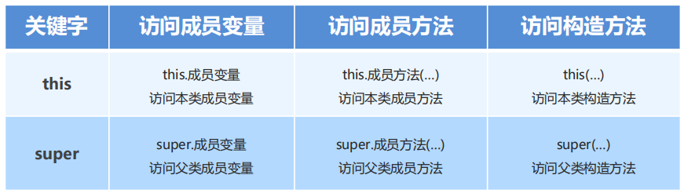
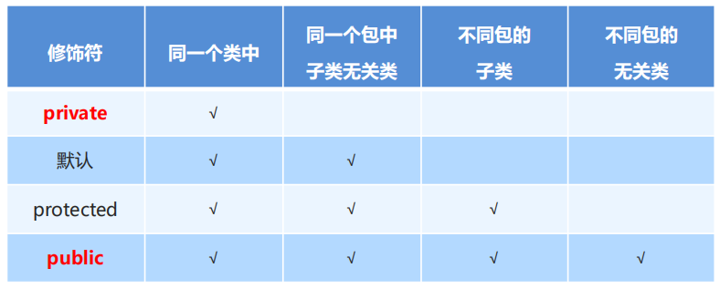
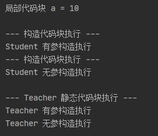

# 面向对象进阶

## 继承

让类与类之间产生关系（子父类关系），**子类**可以直接使用父类中**非私有成员**

继承的格式：

- public class 子类名 extends 父类名 {}

  > `public class Zi extends Fu {}`

父类：也被称为基类、超类
子类：也被称为派生类

### 好处与弊端

**好处**

- 提高了代码的复用性
- 提高了代码的维护性
- 让类与类之间产生了关系，是**多态**的前提

**弊端**

- 继承是侵入性的
- 降低了代码的灵活性

  > 继承关系，导致子类必须拥有父类非私有属性和方法，让子类自由的世界中多了些约束。

- 增强了代码的耦合性
  > 代码与代码之间存在关联都可以将其称为“耦合”
  >
  > “高内聚，低耦合”

**什么时候使用继承？**

- 当类与类之间，存在相同（共性）的内容，并且产生了 **is-a** 的关系，就可以考虑使用继承，来优化代码。

### 特性

- Java 只支持**单继承**，不支持**多继承**，但支持**多层继承**。

Ps:

> **继承 == 原型**
>
> **多层继承 == 原型链**

不能**多继承**的原因：

> 1. 如果多个父类中的拥有**同名**的方法，将会造成**冲突**
> 2. 在子类构造方法初始化时，内部调用 **super()** 初始化**父类**的时候，也会造成**冲突**

**A => B => C**

C 就可以使用 A 和 B 中的所有的非私有成员。

**多层继承**

```java
class A {
    public void sayHi() {
        System.out.println("Hi I`m  A");
    }
}

class B extends A {
    public void sayHello() {
        System.out.println("Hello I`m  B");
    }
}

class C extends B {
    public void sayHaha() {
        System.out.println("Haha I`m C");
    }
}

// TestExtends
public class TestExtends {
    public static void main(String[] args) {
        C c = new C();
        c.sayHello();
        c.sayHi();
        c.sayHaha();
    }
}
```

### 类的成员访问

#### 成员变量访问

> 当类与类构成 **继承** 关系后，父类就像 JS 中的原型对象，子类将拥有父类的属性及方法
>
> Java 在访问成员变量时，查找规则也和 Js 中的**对象属性**查找规则相似：
> 在当前对象中没有找到时，将会去**原型链**中寻找

在子类方法中访问一个变量

- 子类局部范围找
- 子类成员范围找
- 父类成员范围找

如果子父类中，出现了重名的成员变量，通过**就近原则**，会**优先**使用子类的

如果一定要使用父类的，可以通过 **super** 关键字，进行区分

Ps:

> 关于变量的查找规则，**遮蔽**特性在 Java 中依旧适用。

**super 关键字的用法和 this 关键字的用法相似**

- **this**：代表本类对象的引用

  > 用来访问本类的成员（属性、方法）

- **super**：代表父类存储空间的标识（父类对象引用）

  > 用来访问父类的成员（属性、方法）



Ps：

> Java 中的 this 并不是很复杂，至少目前来看，用来指代当前实例。
> 存储的是当前实例的引用地址

#### 成员方法访问

通过子类对象访问一个方法

- 子类成员范围内寻找
- 父类成员范围内寻找

> 就近原则，遮蔽效应
>
> this 指代本类，super 指代父类

#### 方法重写

在继承体系中，子类出现了和父类中**一模一样**的**方法声明**

> 方法名、参数列表、返回值一致

**应用场景**：

> 当子类需要父类的功能，而功能主体子类有自己特有的内容，可以重写父类中的方法，这样，即沿袭了父类的功能，又定义了子类特有的内容

**方法重载**：在同一个类中，方法名相同，参数列表不同，与返回值无关。

> 方法重载的目的在于解决相似逻辑方法，不同参数列表的需求
>
> 方法重写在于解决继承关系中，子类既需要父类的功能，又需要自己的功能

```java
// Father
class Father {
    private String name = "Father";
    private int money = 100000000;

    // 1. 普通成员方法
    public void show() {
        System.out.println(name);
    }

    /*
     * 2. 私有方法
     *
     * 方法重写不能重写 私有方法
     * 私有成员本身就不可以被子类直接访问到
     * */
    private void jiaoQi() {
        System.out.println("罗玉凤");
    }

    /*
     *
     * 3. 静态方法
     *
     * 静态方法重写必须使用相同的静态方法
     * 实际上 静态方法不可以被重写，在子类中定义一个相同的 静态方法
     * 实际上是对父类中的静态方法进行了遮蔽
     * */
    public static void money() {
        System.out.println("father have long money");
    }

    // 4. 参数列表不一致，构成方法重载
    public static void money(int money) {
        System.out.println("Father have " + money + " 元");
    }
}

// Son
class Son extends Father {
    private String name = "son";

    // 子类中的 show 方法是对 父类中的 show 方法的重写
    @Override
    public void show() {
        System.out.println("Sonnnnnnnnnnnnnnnnnnnn");
    }

    // 对父类静态方法 money 的遮蔽
    public static void money() {
        System.out.println("son no money");
    }
}

// main
public class Test {
    public static void main(String[] args) {
        Father fa = new Father();
        Son son = new Son();

        // 父类 show
        fa.show();
        // 子类 重写父类 show
        son.show();

        // 父类静态方法
        fa.money();
        // 静态方法也可以继承，在 “重写” 的时候也必须是静态的
        son.money();

        // 父类的带参数的方法 money 的调用
        fa.money(1000000);
        // 这个调用的其实是 子类继承的父类中的那个带参数的 money 方法
        son.money(100);
    }
}
```

#### 重写注意事项

- 父类中**私有方法**不能被重写

  > 私有成员本身就不可被直接访问（不代表继承不到）

- 父类**静态方法**，子类必须通过**静态方法**进行重写，父类非静态方法，子类也必须通过非静态方法进行重写

  > **注意**：静态方法不能被重写！如果子类中，也存在一个方法声明一模一样的方法，可以理解为，子类将父类中同名的方法，隐藏了起来，并非是方法重写
  >
  > 遮蔽效应

- 子类重写父类方法时，**访问权限**（权限修饰符）必须大于等于父类

**简而言之：**

> 子类**重写方法**都是重写的**实例方法**，不能重写类的**静态方法**，因为静态方法是**属于类**的，被所有实例**共享**
>
> 在子类中声明一个一模一样的**静态方法**，实际上仅是在子类中定义了一个**相同的方法**，将父类中的方法**遮蔽**了，访问的时候也就是访问的子类的静态方法

#### 权限修饰符



### 构造方法访问

子类中所有的**构造方法**，默认都会访问父类中的**无参构造方法**

- 是因为子类在**初始化**的时候，有可能会**使用到父类中的数据**，如果父类没有完成**初始化**，子类将无法使用父类的数据

  > 子类初始化之前，一定要先完成父类初始化

怎么初始化？

- 构造方法的第一条语句 默认都是 **super()**

  > 如果没有手动加，则 Java 默认提供

**注意**：在编写类的时候，如果没有手动**指定父类**，系统会自动继承 **Object**（Java 继承体系中的最顶层父类）

---

如果父类中**没有空参构造**，子类的构造方法要如何访问？

> 首先，如果父类中没有空参构造，不进行处理的话，子类中会报错
>
> 所以，我们需要手动处理，有两种方式：

1. 在子类构造方法中，我们手动**调用父类的有参构造**
2. 子类通过 this 去调用本类的其他构造方法，本类的构造方法再通过 super 去手动调用父类的有参构造

**注意**：this(...) super(...) 必须放在构造方法的**第一行有效语句**，并且二者不能共存。

---

**初始化子类实例变量的方式：**

```java
public class TestConstructor {
    public static void main(String[] args) {
        Son son = new Son("4个亿", 18);
        son.show(); // 我在 18 岁就拥有了 4个亿
    }
}

class Father {
    private String money = "1个亿";
    private int age = 38;

    /*
     *
     * 已知：如果我们为一个类提供了任一构造方法
     * JVM 将不再提供默认的空参构造
     *
     * 而在子类初始化的时候，会默认调用父类的无参构造
     * 所以，一旦当我们为父类提供构造方法，最好也提供一个无参构造
     * */
    public Father(String money, int age) {
        System.out.println("Father 有参构造执行了");
        this.money = money;
        this.age = age;
    }

    public Father() {
        System.out.println("Father 空参构造执行了 --------------------");
    }

    public String getMoney() {
        return money;
    }

    public void setMoney(String money) {
        this.money = money;
    }

    public int getAge() {
        return age;
    }

    public void setAge(int age) {
        this.age = age;
    }

    void show() {
        System.out.println("我在 " + this.age + " 岁就拥有了 " + this.money);
    }
}

class Son extends Father {
    public Son() {
    }

    /*
    *
    * 当一个子类继承一个父类时，
    * 会继承到父类的所有的成员变量、成员方法、静态方法、静态变量
    *
    * 当我们想要为子类中的成员变量进行初始化操作时，此时实际上是需要将父类中所定义的 成员变量进行初始化
    * 那就要在子类的构造方法中，调用父类（super）的有参构造，对其内部的成员变量进行初始化
    *
    * 父类的初始化，在子类的前面
    * 当我们在子类的 构造方法中 对父类进行传参初始化化后，
    * 子类也随之继承到了我们初始化的数据
    * 达到了初始化子类实例的目的
    * */
    public Son(String money, int age) {
        super(money, age);
    }
}
```

## 抽象类

- 抽象方法：将**共性的**行为（方法）**抽取到父类**之后，发现该方法的**实现逻辑无法在父类中给出具体明确**，该方法就可以定义为抽象方法

  > 只是保留了**声明**(所有的重写抽象方法的子类都要使用这个**声明** -- 模板)

* 抽象类：如果一个**类中存在抽象方法**，那么该类就**必须声明为抽象类**

---

**抽象方法**的定义格式：

> `public abstract 返回值类型 方法名(参数列表);`

**抽象类**的定义格式

> `public abstract class 类名{}`

```java
public class Test {
    public static void main(String[] args) {
        Dog dog = new Dog();
        Cat cat = new Cat();

        System.out.println("--- 狗 ---");
        dog.drink(); // 喝水
        dog.eat(); // 狗吃肉

        System.out.println("--- 猫 ---");
        cat.drink(); // 喝水
        cat.eat(); // 猫吃鱼
    }
}

// Animal
abstract class Animal {
    /*
     * Animal 是一个父类
     * Dog 和 Cat 将继承它
     * */

    // 共同的特性抽取出来，抽取到父类中
    public void drink() {
        System.out.println("喝水");
    }

    /*
     * 共同的特性，也会存在个体差异
     * 具体的实现要由具体的子类来决定
     * 也就是在子类中进行重写方法
     *
     * 也就是说，父类中并不知道子类要如何实现
     * 故可将父类中的实现抽象 -- 抽象 = 不明确
     * 将方法定义为抽象方法：
     *   通过 abstract 关键字 将方法修饰为抽象方法
     *
     * 在某一个类中，如果存在抽象方法，那么这个类也必须声明为抽象类
     *   使用 abstract 关键字 -- 写在 class 前面
     * */

    public abstract void eat();
}

// Dog
class Dog extends Animal {
    @Override
    public void eat() {
        System.out.println("狗吃肉");
    }
}

// Cat
class Cat extends Animal {
    @Override
    public void eat() {
        System.out.println("猫吃鱼");
    }
}
```

### 注意事项

- 抽象类不能实例化
- 抽象类中有构造方法
- 抽象类中不一定有抽象方法，有抽象方法的类**一定是抽象类**
- 抽象类的子类
  - 要么重写抽象类中所有的抽象方法
  - 要么是抽象类（无意义）

## final 关键字

**final** 关键字是**最终**的意思，可以修饰（方法、变量、类）

**final** 修饰的特点

- 修饰方法：表明该方法是最终方法，**不能被重写**

  > **应用场景**：模板设计模式中，父类所定义好的方法，不应该让子类重写，使用 final 修饰方法

- 修饰变量：表明该变量是常量，**不能再次被赋值**

  > **final** 修饰成员变量 初始化时机：
  >
  > 1. 在创建的时候，直接给值（推荐）
  > 2. 在构造方法结束之前，完成赋值

- 修饰类：表明该类是最终类，**不能被继承**
  > **应用场景**：一个类中的方法都是核心方法，所有的方法都不应该被重写，可以使用 final 修饰类，让其不再被继承，就不会被重写了

**final 修饰变量，和 JS 中的 const 相似：**

1. 如果变量是**基本数据**类型，则**其值**不能再被更改
2. 如果变量是**引用数据**类型，则存储的**地址**不能发生改变

## 代码块

在 Java 中，使用 {} 括起来的代码称为代码块

分类：

- 局部代码块

  - **位置**：方法中定义
  - **作用**：限定变量的生命周期，及早释放，提高内存利用率

- 构造代码块

  - **位置**：类中方法外定义
  - **特点**：每次构**造方法执行**（构建实例）前，都会执行该代码块中的代码
  - **作用**：将多个构造方法中相同的代码，抽取到构造代码块中，提高代码的复用性

* 静态代码块
  - **位置**：类中方法外定义
  - **特点**：需要通过 **static** 关键字修饰，随着类的加载而加载，并且只执行一次
  - **作用**：在**类加载**的时候做一些数据初始化的操作

```java
public class CodeModule {
    public static void main(String[] args) {
        {
            int a = 10;
            System.out.println("局部代码块 a = " + a);
        }
        /*
        * 1. 局部代码块，在执行完之后，就被释放了，a 不存在了
        * */
        // System.out.println(a); // 报错

        System.out.println();

        /*
         * 2. 构造代码块，每次构建实例的时候都会执行
         * */
        Student stu = new Student(1);
        Student stu1 = new Student();

        System.out.println();

        /*
         * 3. 静态代码块
         *   只会在类加载的时候执行一次
         *   不会随着实例的构建而执行
         * */
        Teacher tea = new Teacher(1);
        Teacher tea1 = new Teacher();
    }
}

// 构造代码块
class Student {
    private int id;

    {
        System.out.println("--- 构造代码块执行 ---");
    }

    public Student(int id) {
        System.out.println("Student 有参构造执行");
        this.id = id;
    }

    public Student() {
        System.out.println("Student 无参构造执行");
    }
}

// 静态代码块
class Teacher {
    private int id;

    static {
        System.out.println("--- Teacher 静态代码块执行 ---");
    }

    public Teacher(int id) {
        System.out.println("Teacher 有参构造执行");
        this.id = id;
    }

    public Teacher() {
        System.out.println("Teacher 无参构造执行");
    }
}
```

**代码运行结果：**

