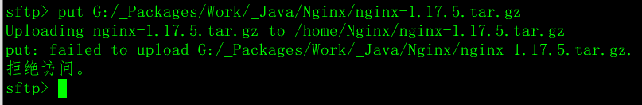
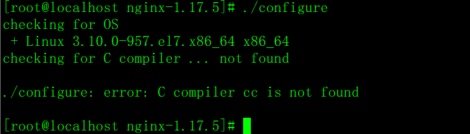

# Nginx 发布网站 静态伺服

## 1.1 Nginx 服务器概述

Nginx 是一种服务器软件，其最主要，最基本的功能是可以与服务器硬件(电脑)结合，让程序员可以将程序发布在 Nginx 服务器上，让成千上万的用户可以浏览。

除此之外，Nginx 还是一种高性能的 HTTP 和反向代理服务器，同时也是一个代理邮件服务器。也就是说，我们在 Nginx 上可以：

1. 可以发布网站(静态, html,css,js)
2. 可以实现负载均衡,
3. 代理服务器
4. 可以作为邮件服务器实现收发邮件等功能

本课程我们只讨论 Nginx 发布网站的功能，其它的功能后续课程会深入学习.

## 1.2 在 Linux 上使用 Nginx

### 1）下载 Nginx

进入http://nginx.org/网站，下载nginx-1.17.5.tar.gz文件


### 2）上传到虚拟机

使用客户端将刚下载好的 nginx-1.17.5.tar.gz 文件上传到 home 目录下。


使用命令查看


#### 上传到虚拟机时可能会遇到的问题



- 原因：如果不是使用的 root 账户登录的 linux 则会出现服务端上传的那个文件夹的 拒绝访问，导致上传失败
- 解决：
  - 第一种，直接用 root 用户登录 ssh 再操作 SFTP 窗口
  - 第二种，切换到 root 用户后，用 chmod 给要上传的服务器文件夹赋权限(便捷)

### 3）准备依赖环境

```shell
#安装Nginx依赖环境，‐y表示所有提示默认选择y
yum -y install pcre pcre-devel
yum ‐y install zlib zlib‐devel  
yum ‐y install openssl openssl‐devel
```

### 4）解压和编译安装

```shell
# 进入home目录,解压
tar -zxvf nginx-1.17.5.tar.gz -C /home

# 进入 nginx目录
cd nginx-1.17.5

# 编译并安装【已经有gcc编译环境】
./configure
make
make install
# 安装成功之后,就会在/usr/local下多出了一个nginx目录.
```

**在新装的 centos7 上面安装 nginx 到时候，执行 configure 会报错**



**解决**：
**执行命令**：

> yum -y install gcc gcc-c++ autoconf automake make

### 5）启动服务器

```shell
#进入nginx的sbin目录
cd /usr/local/nginx/sbin

#在sbin目录下启动
./nginx
#在sbin目录下停止
./nginx ‐s stop
#在sbin目录下重写加载
./nginx ‐s reload

#开放linux的对外访问的端口80，在默认情况下，Linux不会开放80端口号
#需要编辑iptables文件,参考 4.5 操作
#查看是否有nginx的线程是否存在
ps ‐ef | grep nginx

```

### 6）浏览器访问

浏览器输入虚拟机 ip 地址，默认 80 端口


#### 可能会出现的问题

如果在虚拟机中 Nginx 已打开，且 ip 能够 ping 通，但是 服务器 页面无法正常访问

说明是 linux 防火墙的问题，关闭防火墙即可解决

CentOS 7.0 默认使用的是 firewall 作为防火墙

```shell
# 查看防火墙状态
firewall-cmd --state

# 停止firewall：
systemctl stop firewalld.service

# 禁止firewall开机启动：
systemctl disable firewalld.service
```

关闭防火墙后，即可正常访问页面

## 1.3 实现步骤

1. 发布项目
2. 配置 Nginx 服务器
3. 浏览器访问

## 1.4 操作实现

### 1.4.1 发布项目

在/home 目录下，创建 toutiao 目录

```shell
# 进入home目录
cd /home
# 创建目录
mkdir toutiao
```

上传项目文件到 toutiao 目录

项目文件:


toutiao 目录:


### 1.4.2 配置 nginx.conf 文件

```shell
# 编辑 Nginx 配置文件
vim /home/nginx-1.17.5/conf/nginx.conf
```


### 1.4.3 启动服务器

```shell
#启动服务器 ， 加载配置文件
/usr/local/nginx/sbin/nginx -c /home/nginx-1.17.5/conf/nginx.conf
```

### 1.4.4 浏览器访问

1. 浏览器输入虚拟机 ip 地址，默认 80 端口，访问首页 index.html 
2. 跳转登录页面

```java
http://172.16.17.99/login/login.html
```


