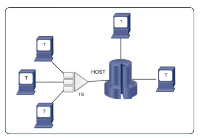
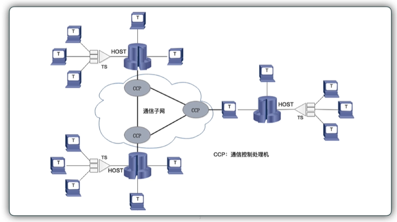
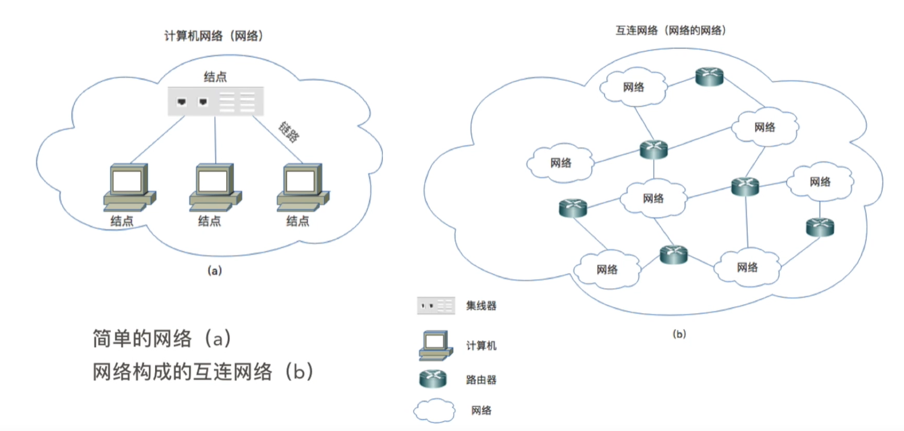
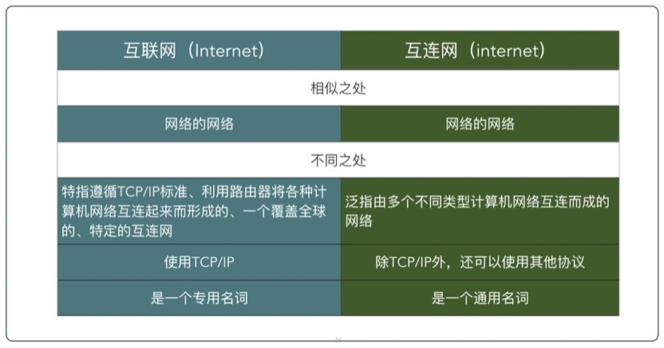

# 计算机网络的发展

本节内容，试掌握：

- 什么是 “网络”
- 什么是 “计算机网络”
- 什么是 “Internet”

## 1. 网络

在人类的生活中，充满着许许多的的 “网络”，比如：

- **交通网络：** 高速公路网络、铁路运输网络、航运网络等。
- **通信网络：** 电信网络、邮政网络等。

将我们所谓的网络具现化后，我们可以发现 “网络” 的特点：

在交通网络中，有许多的站点，如 火车站、汽车站、港口等等，贯穿站点的就是对应的 铁路、公路、河流等等。
无论是交通网络，还是通信网络，网络的作用就是连通人们的生活，共享人们之间的资源，先连通 后共享。

进而总结网路的：

- 共同特点：连线和结点
- 网络作用：连通和共享

## 2. 计算机网络

### 2.1 计算机网络的诞生

计算机网络是随**计算机技术的发展而产生**的。早期的计算机均为 大型机、中型机或小型机。
用户通过终端连接到大型机上(主机)，通过批处理方式，共享大型机上的软硬件资源。

这也就是最初的计算机网络：以主机(host)为中心 (或 “主机 - 终端”) 的网络

结构如下所示：

- 特征：以单处理机为中心的联机网络；集中式控制
- 缺点：主机负荷重；可靠性差。

如果我们从共享的角度来说，其实并不好讲这种模式的网络称之为计算机网络，因为网络的目的就是达成共享的，这种模式下的资源都是存在于一个主机上面的，且终端与终端之间没有办法共享资源。

**终端的概念**

早期终端：是主机的一个远程的 输入/输出 设备（不是一个**自治系统**）。
在早期计算机主机昂贵，一个主机一般会配置多个 **终端**。
这些终端本身 **不具备计算能力**，仅仅承担 **信息输入输出** 的工作，运算和处理均由主机来完成。

现在的终端都是智能终端，计算机也就是一个终端
个人计算机可以运行称为 **终端仿真程序（如 Windows 的 cmd）** 来模仿一个终端的工作。

### 2.2 先有广域网后有局域网

在 “主机 - 终端” 模式背景下，美国国防部认为，如果仅有一个集中的军事指挥中心，万一这个中心北原苏联的核武器摧毁，全国的军事指挥将处于瘫痪状态，其后果不堪设想，因此有必要设计一个分散的指挥系统 ----- 它由一个个分散的指挥点组成，当部分指挥点北摧毁后，其它点仍能正常工作，而这些分散的点又能**通过某种形式的通讯网取得联系**。

这样的要求下，解决方式为 将多个以主机为中心的 “网络” 连接起来，连接网络，也就是将主机连接起来。

网络也就从 “主机-终端” 转为 “主机-主机”。主机不再只负责运算和处理的工作，还兼顾了通信的功能。

在 1969 年，美国创建了 4 个结点（斯坦福研究院、犹他大学、加州大学圣巴巴拉分校、加州大学洛杉矶分校），将这 4 个结点连接起来作为实验，称之为 **ARPAnet**

ARPA：美国国防部高级研究计划局

**Host-Host 模式：**

这种情况下，主机与主机之间会非常远，这个时候我们就可以将其称之为广域网了。

而前者 “主机-终端” 的网络，终端与终端之间并不能通信，并不能称为局域网。这也是一众教科书不承认这种网络为 “网络” 的原因

**局域网**

局域网的产生的原因：80 年代以后，微型计算机的迅速发展，彼此需要**相互通信（近距离），共享资源**。

- 第一个处理器：1971 年，Intel 公司发布的 4 位微处理器 Intel 4004。
- 第一台微型计算机：1971 诞生的，1981 年 IBM 公司推出微型计算机 IBM-PC。

**局域网的多样式**

局域网(Local Area Network, LAN) 是指在**某一区域**内由**多台计算机**互相称的**计算机组**。
如：以太网、ATM 网、FDDI 网、令牌环网、无线网等。

在微型计算机促生局域网的背景下，各种类型的局域网诞生，不同的局域网使用不同的协议，称之为 **异构的局域网**

两个采用不同协议的局域网如果想要连接起来，要怎么连接呢，是采用哪种协议呢，这成了一个问题。
在 70 年代，ARPA 设立了新的研究项目，为解决不同的计算机**局域网互联**的问题。

解决**异构的局域网**互联，这时候就需要一个统一的协议。

前面提到，在 1969 年，ARPA 将大型主机与大型主机连接起来，形成了 “主机-主机”（ARPAnet） 的网络，那时候采用的是 NCP 协议。

后来出现了 TCP/IP 协议，ARPA 就要求：**采用 IP 协议**将异构局域网互联起来（IP 协议主要是将异构网络**互联**起来）。

这样使用 IP 协议互联起来的网络，研究人员称之为 "Internet"，即 “因特网”。

### 2.3 互连网

**网络的网络**

在《计算机网络》一书中，如下写到：

> 计算机网络由若干结点，和连接这些结点的链路组成。网络中的结点可以是计算机、集线器、交换机和路由器等。
>
> 网络之间还可以通过路由器互连起来，这就构成了一个覆盖范围更大的计算机网络，这样的网络称为**互连网**(internetwork 或 internet)。因此互连网是 “网络的网络”。

**白话：**
我们日常使用的计算机，可以称之为一个结点，而计算机网络是由很多的结点和连接结点的链路组成的，不光是我们使用的计算机，集线器、交换机、路由器等也是计算机网络中的结点。

反过来说，当这些结点通过链路连接起来的时候，也就构成了一个 “网络”，这些结点之间就可以通信，共享资源，也可以理解成局域网。

在现实生活中，肯定有许许多多的这样由结点组成的网络，单有这些局部的网络是没有意义的，要做就做最大的，我们需要将这一个个网络互相连接起来，也就形成了 “互连网”。

这里用的是 “互连网” 而不是 “互联网”。意为互相连接的网。

所以 “互连网” 也就是 “网络的网络”。

“网络” 连接结点，而 “互连网” 用来连接 “网络”。

**互连网：**

## 3. 互“连”网 与 互“联”网 Internet

在计算机网络中，有两个相差很大的名词：internet 和 Internet

> - internet：互连网，是一个通用名词，它泛指由多个计算机网络互相连接而成的计算机网络。在这些网络之间的通信协议（即通信规则）可以任意选择，不一定非要使用 TCP/IP 协议。
>
> - Internet：互联网或因特网，则是一个专用名词，它指当前全球最大的、开发的、由众多网络相互连接而成的特定互连网，它采用 TCP/IP 协议族作为通信的规则，且其前身是美国的 ARPANET。

我们可以任意将几个计算机网络互连起来（不管采用什么协议），并能够相互通信，这样构成的是一个互连网(internet)，而不是互联网(Internet)

