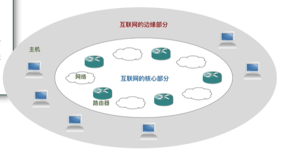
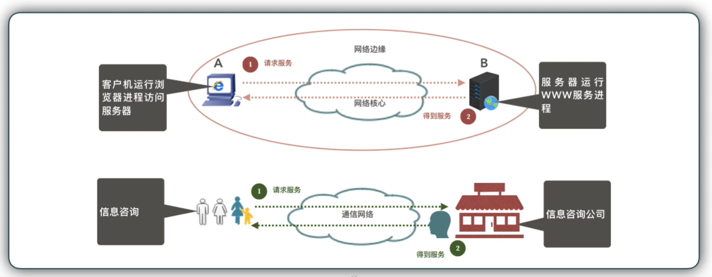
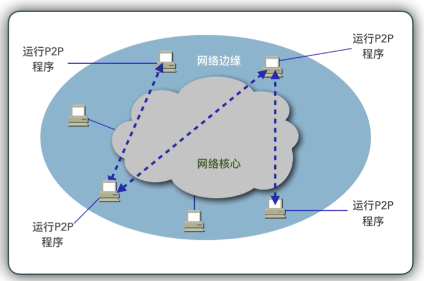

# 互联网的组成与通信方式

本节内容，试掌握：

- 互联网的组成
- 互联网的通信方式

## 1. 互联网的组成

互联网由两部分组成

- 边缘部分：由所有连接在互联网上的主机组成。这部分是用户直接使用的，用来进行通信（传送数据、音频或视频）和资源共享。
- 核心部分：由**大量网络**和连接这些网络的**路由器**组成。这部分是为边缘部分**提供服务**的（提供连通性和交换）。

**互联网的组成：**

这里有一个需要注意的点，一个主次关系的区分：

**互联网的核心部分是为边缘部分提供通信和交换服务的，而我们真正的使用者是主机与主机之间数据共享。**

### 1.1 互联网的边缘部分

- 互联网边缘部分：连接在互联网上的所有的主机，又称为端系统(end system)。
- 小的端系统：个人电脑、智能手机、网络摄像头、智能家居等。
- 大的端系统：大型计算机。
- 拥有者：个人、单位或某个 ISP。

## 2. 互联网的通信方式

### 2.1 端系统之间通信的含义

我们已知互联网边缘部分，端与端之间的通信是必要的，那么实际上：

“主机 A 和主机 B 进行通信”：

“运行在主机 **A 上的**某个**程序**和运行在主机 **B 上的**另一个 `程序` 进行**通信**”。

即：“主机 A 的某个进程和主机 B 上的另一个进程进行通信”

简称为“计算机之间通信”

### 2.2 端系统之间的通信方式

端系统之间的通信方式有两种：

- 客户服务器方式（C/S 方式）：即 Client/Server 方式，简称为 C/S 方式。
- 对等方式（P2P 方式）：即 Peer-to-Peer 方式，简称为 P2P 方式。

### 2.3 客户 - 服务器工作方式

客户（client）和服务器（server）都是指通信中所涉及的两个应用进程。
“客户 - 服务器”：进程之间服务和被服务的关系。
客户是服务的请求方，服务器是服务的提供商。

**C/S 模式：**

所谓的 C/S 模式，就是一方发送请求信息，另一方接收到请求后，处理请求，处理完后，再返回给请求方。

**A => B（接收请求 -> 处理请求 -> 结果）=> A**

这样一轮下来，就完成了端 A 与 端 B 的一次通信。

结合现实生活，就像你想要咨询某个法律信息：

- 你打电话给律师事务所（发送请求）
- 律师事务所接到你的电话，并开始倾听你的问题（服务商接收请求）
- 然后回答你的法律问题（响应请求）
- 完成咨询（通信完成）

现实生活中大量的社交都是客户服务器模式。去超市买东西，食堂吃饭.....

C/S 模式的特点：**资源集中式管理**

---

我们已知：端与端之间的通信是靠端中的某个进程，也就是某个软件来进行的。
C/S 模式下：客户端有客户端的软件，服务端有服务端的软件，下面来对比下客户软件与服务软件。

**客户软件的特点：**

- 被用户调用后运行，在打算通信是主动向原地服务器发起通信（请求服务）。因此，客户程序必须知道**服务器程序的地址**
- 不需要特殊的硬件和很复杂的操作系统（相对于服务器硬件和系统）

**服务器软件的特点：**

- 一种专门用来**提供某种服务的程序**，可同时处理多个远地或本地客户的请求（例如：IIS、Apache、Proftpd 等）。
- 启动后需要一直**不断地运行**着，被动地**等待并接受**来自客户的通信请求。服务器程序不需要知道客户程序的地址。
- 一般需要强大的硬件和高级的操作系统支持。

客户服与服务器的通信关系建立后，通信可以是双向的，客户和服务器都可以发送和接收数据。

### 2.4 对等连接方式（P2P）

ps：英文中 to 与 two 同因，故 peer-to-peer 简写为 P2P，千万不要读作 P 二 P

**对等连接：** 两个通信主机不区分哪一个是服务请求方还是服务提供方。
只要两个主机都运行了对等连接软件（P2P 软件），它们就可以进行**平等的**、对等连接通信。
对等连接方式仍然是使用客户服务器方式，每一个主机**既是客户又是服务器**

对等连接工作方式可支持大量对等用户（如上百万个）同时工作。

**Peer-to-Peer：**

## 总结

- 互联网的组成
  - 边缘部分
  - 核心部分
- 端系统进程间通信
  - 端 A 与端 B 间进行通信，实际上是端 A 中的某一个软件与端 B 中的另一个软件进行通信
  - 进行通信的方式是网络通信
- 通信模式
  - C/S(Client - Server)
  - P2P(Peer-to-Peer)
