# 互联网核心部分

本节内容，试掌握：

网络核心部分有哪些交换技术：

- 电路交换
- 分组交换
- 报文交换

网络核心部分是互联网中最复杂的部分，因为网络中的核心部分要向网络边缘中的大量主机提供**连通性**，使边缘部分中的任何一台主机都能够向其他主机**通信**。

在网络核心部分起特殊作用的是**路由器(router)**，它是一种专用计算机（但不叫做主机）。路由器是实现**分组交换(packet switching)**的关键构件，其任务是**转发**收到的分组，这是**网络核心部分最重要的功能**。

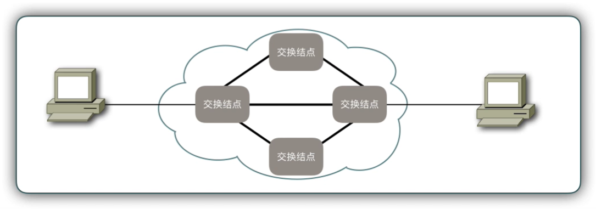

为了弄清分组交换，下面先介绍**电路交换**的基本概念。

## 1. 电路交换

在传统的电话通信中，两部电话之间用一根线直接连接起来就能够互相通话了。

后来人们就发现，要让所有的电话机都两两相连接是不现实的。

两部电话只需要一对电线就能够互相连接起来，但若有 5 部电话要两两相连这需要 10 对电话线，如下图所示。

显然，若 N 部电话要两两相连，就需要 N(N-1)/2 对电线。当电话机的数量很大时，这种连接方法需要的电线数量就太大了。

**电话线：**
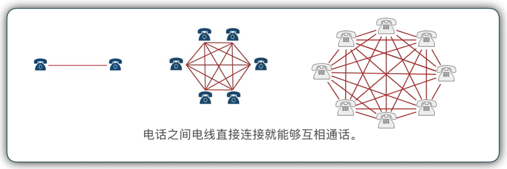

**电话人工交换机**

当电话机的数量增多时，就要使用交换机来完成全网的交换任务，于是出现了“交换”。

1878 年人工电话交换机出现，电话接续过程中的接线、拆线等完全由话务员手工操作。

人工交换机的缺点：容量很小，需要占用大量人力，工作繁重，效率低下，容易出错。

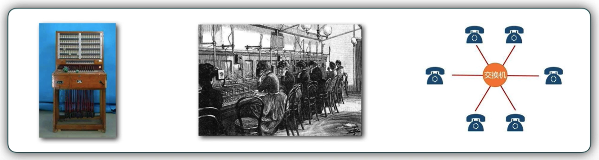

电话人工交换机，我想应该都在电视中看到过这样的情景：
主人公 A 给主人公 B 打电话，这边先有一个话务员接电话，然后如下对话

话务员：您好，请问要接通哪里
A：你好，我要接 XX 学校

然后话务员一顿倒拾，先拔了一根线，又把这根线插到另一个插口上去，然后 A 和 B 就这样神奇的接通了。

---

**第一台步进制电话交换机**

1891 年，一个名叫**史瑞乔**的殡仪馆老板，发明了该**交换机**。

非常有意识的一个故事：这个老板发现偶然间发现自己店里的生意越来越差，发现打到自己店里的生意电话，总会被话务员转接到另一家殡仪馆。后来才知道，原来当地话务员是那家殡仪馆老板的堂弟。于是，他很生气，发誓一定要发明一个不需要人工操作的**交换机**。

1892 年，第一个“史瑞乔步进制电话交换机”在美国投入使用。

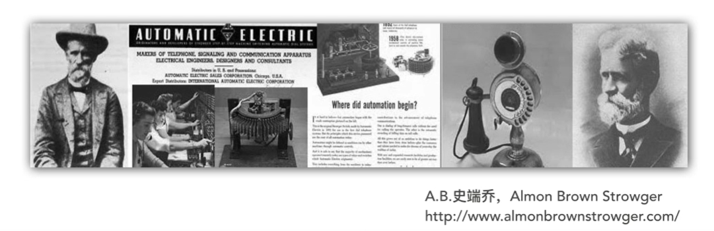

### “交换” 的含义

在这里，**“交换”**(switching) 的含义就是**转接**：把一条电话线**转接到另一条电话线**，使它们连通起来。

从通信资源的分配角度来看，“交换”就是按照某种方式**动态地分配传输线路的资源**。

**交换：**在多节点通信网络中，为有效利用通信设备和线路，**动态地设定通信双方间的线路**，动态地**接通或断开通信线路**，称为 **“交换”**

交换方式分类：

- 电路交换
- 存储交换：报文交换、分组交换、信元交换

### 电路交换的实际意义

> 在使用电路交换通话之前，必须先拨号请求建立连接。当被叫用户听到交换机送来的振铃音并摘机后，从主叫端到被叫端就建立了一条连接，也就是一条**专用的物理通路**。
>
> 这条连接保证了双方通话时所需的通信资源，而这些资源在双方通信时不会被其他用户占用。此后主叫和被叫双方就能互相通话。
>
> 通话完毕挂机后，交换机释放刚才使用的这条专用的物理通路（即把刚才占用的所有通信资源归还给电信网）。
>
> 这种必须经过：
>
> - **建立连接**（占用通话资源）↓
> - **通话**（一直占用通信资源）↓
> - **释放连接**（归还通信资源）。
>
> 三个步骤的交换方式，称为电路交换。
>
> 如果用户在拨号呼叫时电信网的资源已不足以支持这次的呼叫，则主叫用户会听到忙音，表示电信网不接受用户的呼叫，用户必须挂机，等待一段时间后再重新拨号。

**电路交换特点**
电路交换必定是 **面向连接** 的。
主要特点：

- 在发送数据前，通信双方必须建立 **临时专用（独占）** 的 **物理通路**；
- 该物理通路由通信双方之间的 **交换设备** 和 **链路逐段连接** 而成；
- 建立物理通路 **时间较长**，数据传送 **延迟较短**。（在建立物理通路时，可能需要辗转 n 个交换机，所以在建立通路上，会花费较多的时间。但是一旦将物理通路建立起来，数据就直接在这一条专用线路上传输，速度是非常快的，延迟就会较短）

电路交换分为三个阶段：

- **建立电路**（连接）：建立一条专用的物理通路，以保证双方通话时所需的通信资源在通信是不会被其他用户占用；
- **传输数据**（通信）：主叫和被叫双方就能互相通电话；
- **拆除电路**（释放连接）：释放刚才使用的这条专用的物理通路（释放刚才占用的所有通信资源）。

**电路交换示例**
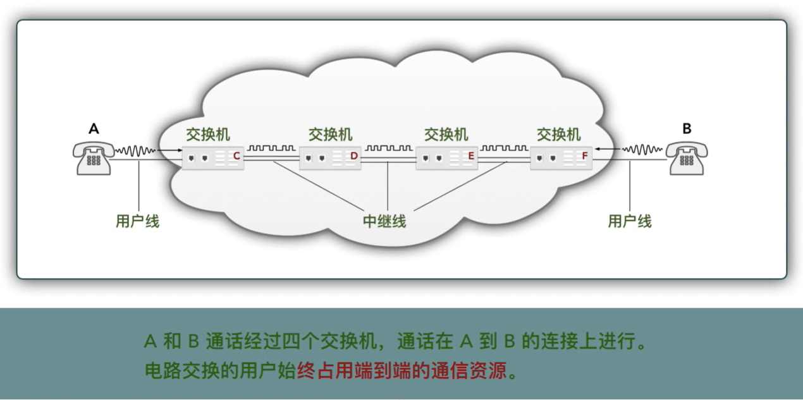

---

**将交换的含义，与电路交换的含义结合到一起就是：**

交换是指按照某种方式，动态地分配传输线路的资源。在电信网中，分配资源的方式是采用的**电路交换方式**。电路交换首先要建立连接，然后保持连接，最后断开连接。

**交换是广义，电路交换是一种方法。**

---

**电路交换的优缺点**
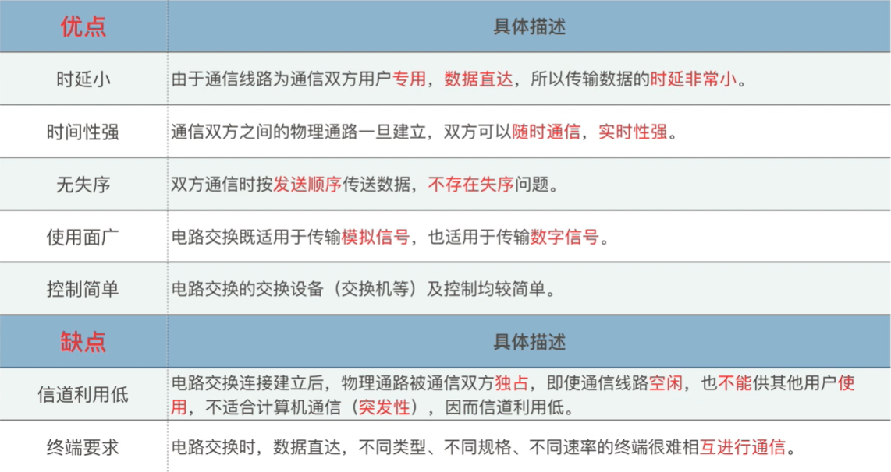

### 小结

“交换”的概念

- 动态分配线路资源

交换的分类：

- 电路交换
- 存储交换：报文交换、分组交换、信元交换

电路交换的主要特点

- 建立临时通路
- 逐段占用链路
- 通路建立时间长
- 数据传输时延小

电路交换的三个阶段

1. 建立电路
2. 传输数据
3. 拆除电路

电路交换的优缺点

## 2. 分组交换

### 2.1 什么是分组

主机之间的通信，实际上就是主机之间数据的交换，主机 A 向主机 B 发送数据，主机 B 接受主机 A 发送过来的数据，这样一来二去，也就形成了所谓的通信。

> 通常我们把要发送的整块数据称为一个**报文（message）**。在发送报文之前，先将报文划分成为一个个更小的等长数据段，例如，每个数据段为 1024 bit。
>
> 在每一个数据段前面，加上一些由必要的控制信息组成的**首部（header）** 后，就构成了一个**分组（packet）**。分组又称为 **“包”** ，而分组的首部也可称为 **“包头”**。
>
> 分组是在互联网中传送的数据单元。

分组中的“首部”是非常重要的，正式由于分组的首部包含了诸如目的地址和源地址等重要信息，每一个分组才能在互联网中独立地选择传输路径，并被正确的交付到分组传输的终点。

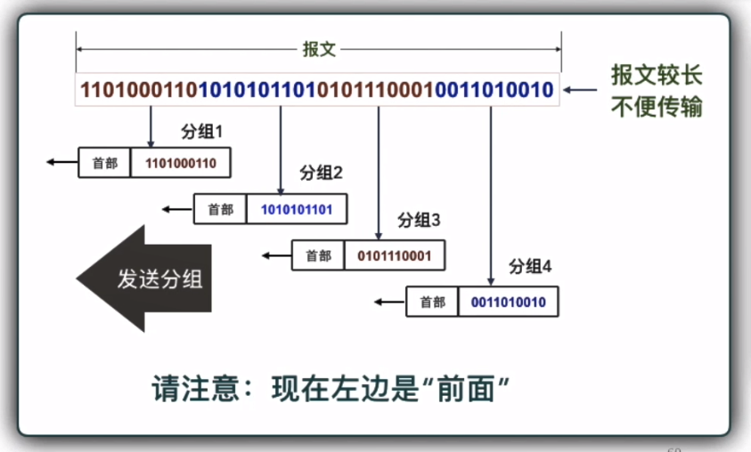

**分组特点：**

1. **分割：**将完整的，较长的数据块分成等长的、较小的数据段。
2. **包装：**将每一段数据段包装，添加一个“首部”信息。“首部”信息包含一些必要的控制信息（包含目的地、来源地等）。

**“首部” 的重要性：**

**每一个分组**的首部都含有**地址**（诸如目的地址和源地址） 等**控制信息**；

分组交换网中的**结点交换机**根据收到的分组首部中的**地址信息**，把分组转发到下一个**结点交换机**。

每个分组在互联网中**独立地**选择传输路径。

用这样的**存储转发**方式，最后分组就能到达最终目的地。

**分组接收：**

接收端收到分组后**剥去**首部还原成报文。

最后，在接收端把收到的数据恢复成**原来的报文**。

这里我们假定分组在传输过程中**没有出现差错**，转发时也**没有被丢弃**。

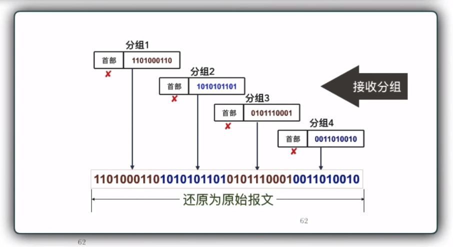

### 2.2 路由器转发分组过程

> 位于网络边缘的主机和位于网络核心部分的路由器都是计算机，但它们的作用却很不一样。
>
> **主机是为用户进行信息处理的**，并且可以和其他主机通过网络交换信息。
>
> **路由器则是用来转发分组的，即进行分组交换的**。

路由器之间用**高速链路**相连接，主机接入到核心采用**较低速率**的链路相连接。

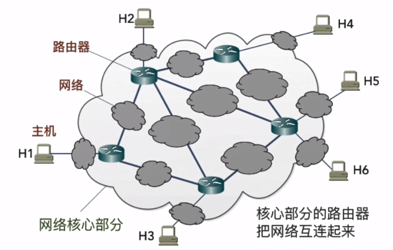

**路由器：**

首先路由器的最重要的功能就是**分组转发**。

即：**将分组从一个网络转发到另一个网络**。

路由器有两个接口：**输入和输出接口**，且接口之间没有直接连线。
如果输入输出接口直接连接，那将是无意义的。

**思科路由器**
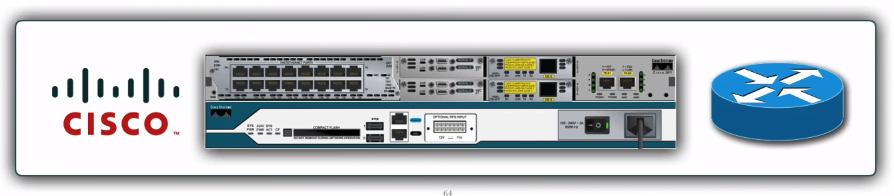

**路由器处理分组的过程：**

1. 把收到的分组先**放入缓存（暂时存储）**；
2. 查找**转发表**，找出到某个目的地址应从哪个端口转发；
3. 把分组送到适当的端口**转发**出去。

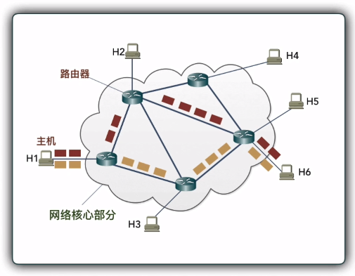

如上图所示：

主机 H1 发送分组给目标主机 H6，我们可以看到有两条**不同的路径**。

之所以会有不同的路径，是因为路由器在将分组发送到下一转发结点之前会查找转发表，而转发表的作用就是用来查找合适的传输路径的，这个合适的传输路径是由各路由器**协同计算（路由选择协议算法）**得到的。

所谓的合适的路径也就是指路径的传输速度如何，当然传输速度越快越好。

**在这里我们要明白：**

报文在分成一个个分组后，分组在传输过程中，**每个分组走的路线可能并不一样**，即使走的路线不一致，最终需要保证的是安全的到达目的地。

---

路由器进行转发分组的过程，就像现实中的物流快递一样：

1. 揽收货物 -- 接收分组
2. 存储货物 -- 存储分组（暂时存储）
3. 查找下一站物流地 -- 查找转发表（查找下一转换结点、查找合适传输路径）
4. 货物发货 -- 找到转发端口，转发分组

**路由器处理分组的生活例子：**

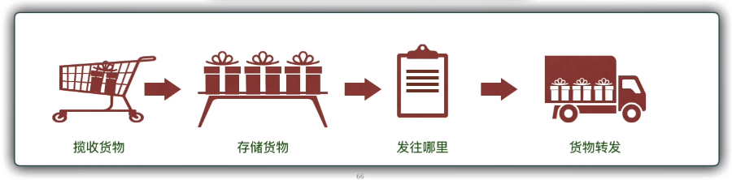

### 2.3 分组交换优缺点

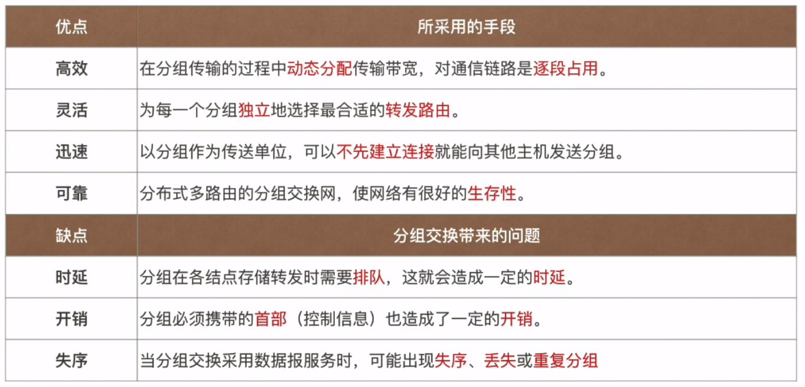

### 小结

分组：

- 报文分割
- 包装携带首部信息

路由器最终要的功能：分组交换

1. 接收分组 **↓**
2. 存储分组（暂时存储） **↓**
3. 查找转发表 **↓**
4. 发送分组

## 3. 报文交换

> 从本质上讲，断续分配传输带宽的存储转发原理并非是完全新的概念。自古代就有的邮政通信，就其本质上来说也属于存储转发方式。
>
> 在 20 世纪 40 年代，电报通信也采用了基于存储转发原理的**报文交换（message switching）**。
>
> 在报文交换中心，一份电报被接收下来，并穿成纸带。操作员以每份报文为单位，撕下纸带，根据报文的目的站地址，拿到相应的发报机转发出去。
>
> 这种报文交换的时延较长，从几分钟到几小时不等。现在报文交换已不使用了。

优点：

- 无需建立连接，用户随时发送报文；
- 不同时间一段一段地占用通信线路，通信**线路利用率高**。

缺点：

- 报文交换的**时延较长**；
- 只适用于**数字信号**；
- 报文长度没有限制，中间转发结点**存储空间**大。

## 三种交换的比较

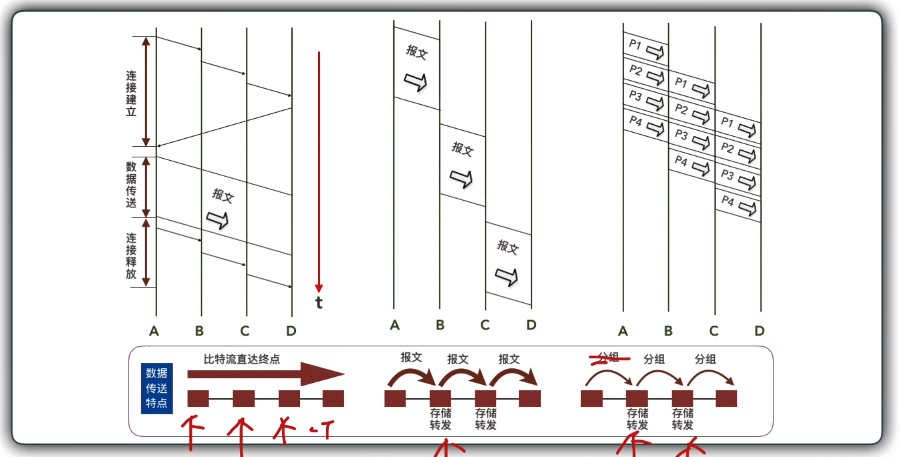

- **电路交换：** 整个报文的比特流连续地从源点直达终点，好像在一个管道中传送。
- **报文交换：**整个报文先传送到相邻结点，全部存储下来后查找转发表，转发到下一结点。
- **分组交换：**单个分组（这只是整个报文的一部分）传送到相邻结点，存储下来后查找转发表，转发到下一个结点。

**选择**

> 如要**连续传送**大量的数据，且其**传送时间远大于连接建立时间**，则电路交换的传输速率较快。
>
> 报文交换和分组交换不需要预先分配传输带宽，在**传送突发数据**时可提高整个网络的**信道利用率**。
>
> 由于一个分组的长度远远小于整个报文的长度，因此**分组交换比报文交换的时延小**，同时也具有更好的**灵活性**。
