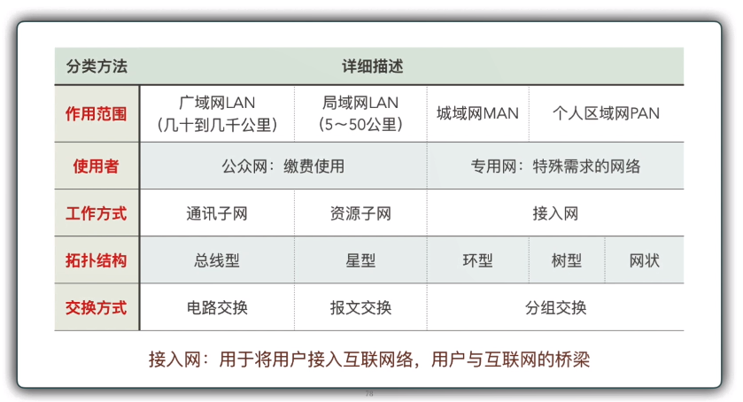

# 计算机网络的定义

本节内容，试掌握：

- 计算机网络的定义
- 计算机网络的功能
- 计算机网络的分类

## 计算机网络

利用通信设备和线路将**地理位置**不同的、功能独立的多个**计算机系统连接起来**，在功能完善的**网络软件和协议**管理下，实现网络**端系统**的硬件、软件**资源共享**和**信息传递**的系统。

由**结点**（node）和**链路**（link）组成。

**计算机网络的作用：**

- **数字化：**现代技术的发展，现实世界可以存储到计算机中，这就是数字化。
- **信息化：**数字化的现实世界，为人们的生活、工作、学习辅助决策等等和人类相关的各种行为带来巨大影响，提高各种行为的效率，这就是信息化。
- **网络化：**实现数字化、信息化共享。

**三个要点：**

1. 必须有**两台或两台**以上、具有独立功能的**计算机自治系统**相互连接起来，以达到**资源共享**的目的；（结点）
2. 必须要有一条**通道**（有形或无形的），来使计算机之间**交换信息**；（链路）
3. 必须准守某种**约定和规则**才能实现信息交换。（协议）

**自治系统**：自治自理，自主决定何时发送数据。

网络连接的端系统不限于计算机，而是包含了**各类智能设备**。

## 计算机网络功能

计算机网络除了资源共享之外，还有如下功能：

- **分布式处理**：同一工作任务可由多台计算机通共完成（部分工作）。
- **负载均衡**：同一工作任务由多台计算机轮流或同时完成。
- **大数据**：常规方法无法处理，不用随机分析法（抽样调查）这样捷径，而采用所有数据进行分析处理。

## 计算机网络分类

