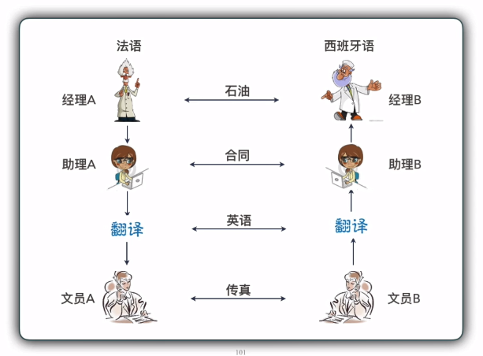

# 计算机网络体系结构：分层

本节内容，试掌握：

- 分层的概念（为什么要分层、分层的原则）
- 各层应完成的主要功能
- 分层的优点与缺点
- 协议的概念
- 协议的三要素

## 1. 为什么要分层

日常生活中，在遇到较难解决的问题时，如果我们把问题分成多步去完成，将问题细化，完成每一小步，最终达成解决问题的目的。

就像图中的例子：

法国老板 A 要和西班牙经理 B 签合同，要经历以下步骤：

- 老板 A 让助理 A 起草合同内容
- 助理 A 将合同内容交给翻译去翻译成双方都接受的语言
- 然后交给文员 A 通过传真发送给文员 B
- 西班牙方的文员 B 在接收到法国方发送过来的传真后交由翻译，翻译成西班牙语
- 翻译在翻译完后，交给助理 B
- 助理 B 排版后交由西班牙经理 B
- 完成合同的一次传递

这样本来可能会存在的语言沟通问题，通过一层层传递的方式完美的解决了。

**计算机网络的分层**

计算机网络是个非常复杂的系统。

相互通信的两个计算机系统必须高度协调工作才行，而这种“协调”是相当复杂的。

“分层”可将**庞大而复杂的问题**，转化为若干**较小的局部问题**，而这些较小的局部问题就比较**易于研究和处理**。

**分层规则：**

- 按**功能**进行抽象分层
- 定义层间接口和提供什么**服务**（下层为上层提供什么服务、接口），层间如何调用服务
- **对等层间**的必须遵循的**规则**（协议）（比如上例：翻译与翻译之间采用什么通用语言来翻译、文员与文员之间采用什么方式发送）

## 2. 协议

计算机网络中的数据交换必须遵守**事先约定好的规则**。

这些**规则**明确了所交换数据的**格式**以及相关的**同步**问题（同步含有时序的意思）。

**网络协议**（network protocol），简称为**协议**，是为进行网络中的数据交换而建立的**规则、标准或约定**。

现实生活中，人们也要遵循许多的规则，比如：

- 传统教学遵循的教学秩序；
- 人类社会生活遵循的法律规则；
- 国际关系的基本准则；
- 人与人之间交流的基本礼仪等。

这些都是**事先约定好的规则**。

**注意：** 在计算机网络中的所存在的**协议**，都是针对**对等层**作用的。

### 2.1 网络协议的三个组成要素

- **语法**：数据与控制信息的结构或格式，解决交换信息的**格式问题**。
- **语义**：需要发出何种控制信息，完成何种动作以及做出何种响应。解决**做什么的问题**。
- **同步**：事件实现顺序的详细说明。什么时间什么条件下做某一特定操作的规定，解决**先做什么后做什么的问题**。

注意很多条件是**不可预测**的，不可能有十全十美的协议。

例如课堂上课：

语法：中文授课，教师与学生按中文语法结构交换信息
语义：交换的信息中各字段的含义
同步：教师讲，学生听；教师问，学生答；学生问，教师答。
