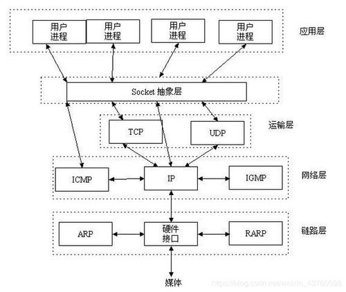
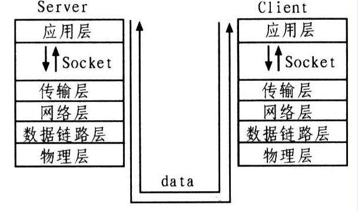
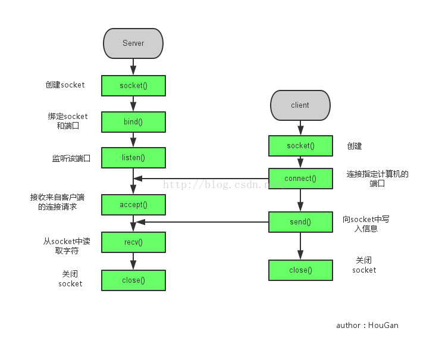

## 1.网络编程入门

### 1.1 网络编程概述【理解】

- 计算机网络

  是指将地理位置不同的具有独立功能的多台计算机及其外部设备，通过通信线路连接起来，在网络操作系统，网络管理软件及网络通信协议的管理和协调下，实现资源共享和信息传递的计算机系统

- 网络编程

  在网络通信协议下，不同计算机上运行的程序，可以进行数据传输

### 1.2 网络编程三要素【理解】

- IP 地址

  要想让网络中的计算机能够互相通信，必须为每台计算机指定一个标识号，通过这个标识号来指定要接收数据的计算机和识别发送的计算机，而 IP 地址就是这个标识号。也就是设备的标识

- 端口

  网络的通信，本质上是两个应用程序的通信。每台计算机都有很多的应用程序，那么在网络通信时，如何区分这些应用程序呢？如果说 IP 地址可以唯一标识网络中的设备，那么端口号就可以唯一标识设备中的应用程序了。也就是应用程序的标识

- 协议

  通过计算机网络可以使多台计算机实现连接，位于同一个网络中的计算机在进行连接和通信时需要遵守一定的规则，这就好比在道路中行驶的汽车一定要遵守交通规则一样。在计算机网络中，这些连接和通信的规则被称为网络通信协议，它对数据的传输格式、传输速率、传输步骤等做了统一规定，通信双方必须同时遵守才能完成数据交换。常见的协议有 UDP 协议和 TCP 协议

### 1.3 IP 地址【理解】

IP 地址：是网络中设备的唯一标识

- IP 地址分为两大类

  - IPv4：是给每个连接在网络上的主机分配一个 32bit 地址。按照 TCP/IP 规定，IP 地址用二进制来表示，每个 IP 地址长 32bit，也就是 4 个字节。例如一个采用二进制形式的 IP 地址是“11000000 10101000 00000001 01000010”，这么长的地址，处理起来也太费劲了。为了方便使用，IP 地址经常被写成十进制的形式，中间使用符号“.”分隔不同的字节。于是，上面的 IP 地址可以表示为“192.168.1.66”。IP 地址的这种表示法叫做“点分十进制表示法”，这显然比 1 和 0 容易记忆得多

  - IPv6：由于互联网的蓬勃发展，IP 地址的需求量愈来愈大，但是网络地址资源有限，使得 IP 的分配越发紧张。为了扩大地址空间，通过 IPv6 重新定义地址空间，采用 128 位地址长度，每 16 个字节一组，分成 8 组十六进制数，这样就解决了网络地址资源数量不够的问题

- DOS 常用命令：

  - ipconfig：查看本机 IP 地址

  - ping IP 地址：检查网络是否连通

- 特殊 IP 地址：
  - 127.0.0.1：是回送地址，可以代表本机地址，一般用来测试使用

### 1.4 InetAddress【应用】

InetAddress：此类表示 Internet 协议（IP）地址

- 相关方法

  | 方法名                                    | 说明                                                             |
  | ----------------------------------------- | ---------------------------------------------------------------- |
  | static InetAddress getByName(String host) | 确定主机名称的 IP 地址。主机名称可以是机器名称，也可以是 IP 地址 |
  | String getHostName()                      | 获取此 IP 地址的主机名                                           |
  | String getHostAddress()                   | 返回文本显示中的 IP 地址字符串                                   |

- 代码演示

  ```java
  public class InetAddressDemo {
      public static void main(String[] args) throws UnknownHostException {
  		//InetAddress address = InetAddress.getByName("itheima");
          InetAddress address = InetAddress.getByName("192.168.1.66");

          //public String getHostName()：获取此IP地址的主机名
          String name = address.getHostName();
          //public String getHostAddress()：返回文本显示中的IP地址字符串
          String ip = address.getHostAddress();

          System.out.println("主机名：" + name);
          System.out.println("IP地址：" + ip);
      }
  }
  ```

### 1.5 端口和协议【理解】

- 端口

  - 设备上应用程序的唯一标识

- 端口号

  - 用两个字节表示的整数，它的取值范围是 0~65535。其中，0~1023 之间的端口号用于一些知名的网络服务和应用，普通的应用程序需要使用 1024 以上的端口号。如果端口号被另外一个服务或应用所占用，会导致当前程序启动失败

- 协议

  - 计算机网络中，连接和通信的规则被称为网络通信协议

- UDP 协议

  - 用户数据报协议(User Datagram Protocol)
  - UDP 是无连接通信协议，即在数据传输时，数据的发送端和接收端不建立逻辑连接。简单来说，当一台计算机向另外一台计算机发送数据时，发送端不会确认接收端是否存在，就会发出数据，同样接收端在收到数据时，也不会向发送端反馈是否收到数据。
  - 由于使用 UDP 协议消耗系统资源小，通信效率高，所以通常都会用于音频、视频和普通数据的传输
  - 例如视频会议通常采用 UDP 协议，因为这种情况即使偶尔丢失一两个数据包，也不会对接收结果产生太大影响。但是在使用 UDP 协议传送数据时，由于 UDP 的面向无连接性，不能保证数据的完整性，因此在传输重要数据时不建议使用 UDP 协议

- TCP 协议

  - 传输控制协议 (Transmission Control Protocol)

  - TCP 协议是面向连接的通信协议，即传输数据之前，在发送端和接收端建立逻辑连接，然后再传输数据，它提供了两台计算机之间可靠无差错的数据传输。在 TCP 连接中必须要明确客户端与服务器端，由客户端向服务端发出连接请求，每次连接的创建都需要经过“三次握手”

  - 三次握手：TCP 协议中，在发送数据的准备阶段，客户端与服务器之间的三次交互，以保证连接的可靠

    第一次握手，客户端向服务器端发出连接请求，等待服务器确认

    第二次握手，服务器端向客户端回送一个响应，通知客户端收到了连接请求

    第三次握手，客户端再次向服务器端发送确认信息，确认连接

  - 完成三次握手，连接建立后，客户端和服务器就可以开始进行数据传输了。由于这种面向连接的特性，TCP 协议可以保证传输数据的安全，所以应用十分广泛。例如上传文件、下载文件、浏览网页等

## 2.UDP 通信程序

### 2.1 UDP 发送数据【应用】

- Java 中的 UDP 通信

  - UDP 协议是一种不可靠的网络协议，它在通信的两端各建立一个 Socket 对象，但是这两个 Socket 只是发送，接收数据的对象，因此对于基于 UDP 协议的通信双方而言，没有所谓的客户端和服务器的概念
  - Java 提供了 DatagramSocket 类作为基于 UDP 协议的 Socket

- 构造方法

  | 方法名                                                      | 说明                                                   |
  | ----------------------------------------------------------- | ------------------------------------------------------ |
  | DatagramSocket()                                            | 创建数据报套接字并将其绑定到本机地址上的任何可用端口   |
  | DatagramPacket(byte[] buf,int len,InetAddress add,int port) | 创建数据包,发送长度为 len 的数据包到指定主机的指定端口 |

- 相关方法

  | 方法名                         | 说明                   |
  | ------------------------------ | ---------------------- |
  | void send(DatagramPacket p)    | 发送数据报包           |
  | void close()                   | 关闭数据报套接字       |
  | void receive(DatagramPacket p) | 从此套接字接受数据报包 |

- 发送数据的步骤

  - 创建发送端的 Socket 对象(DatagramSocket)
  - 创建数据，并把数据打包
  - 调用 DatagramSocket 对象的方法发送数据
  - 关闭发送端

- 代码演示

  ```java
  public class SendDemo {
      public static void main(String[] args) throws IOException {
          //创建发送端的Socket对象(DatagramSocket)
          // DatagramSocket() 构造数据报套接字并将其绑定到本地主机上的任何可用端口
          DatagramSocket ds = new DatagramSocket();

          //创建数据，并把数据打包
          //DatagramPacket(byte[] buf, int length, InetAddress address, int port)
          //构造一个数据包，发送长度为 length的数据包到指定主机上的指定端口号。
          byte[] bys = "hello,udp,我来了".getBytes();

          DatagramPacket dp = new DatagramPacket(bys,bys.length,InetAddress.getByName("127.0.0.1"),10086);

          //调用DatagramSocket对象的方法发送数据
          //void send(DatagramPacket p) 从此套接字发送数据报包
          ds.send(dp);

          //关闭发送端
          //void close() 关闭此数据报套接字
          ds.close();
      }
  }
  ```

### 2.2UDP 接收数据【应用】

- 接收数据的步骤

  - 创建接收端的 Socket 对象(DatagramSocket)
  - 创建一个数据包，用于接收数据
  - 调用 DatagramSocket 对象的方法接收数据
  - 解析数据包，并把数据在控制台显示
  - 关闭接收端

- 构造方法

  | 方法名                              | 说明                                                |
  | ----------------------------------- | --------------------------------------------------- |
  | DatagramPacket(byte[] buf, int len) | 创建一个 DatagramPacket 用于接收长度为 len 的数据包 |

- 相关方法

  | 方法名           | 说明                                     |
  | ---------------- | ---------------------------------------- |
  | byte[] getData() | 返回数据缓冲区                           |
  | int getLength()  | 返回要发送的数据的长度或接收的数据的长度 |

- 示例代码

  ```java
  public class ReceiveDemo {
      public static void main(String[] args) throws IOException {
        	//创建接收端的Socket对象(DatagramSocket)
        	DatagramSocket ds = new DatagramSocket(12345);

        	//创建一个数据包，用于接收数据
        	byte[] bys = new byte[1024];
        	DatagramPacket dp = new DatagramPacket(bys, bys.length);

        	//调用DatagramSocket对象的方法接收数据
        	ds.receive(dp);

        	//解析数据包，并把数据在控制台显示
        	System.out.println("数据是：" + new String(dp.getData(), 0,                                             dp.getLength()));
          }
      }
  }
  ```

### 2.3UDP 通信程序练习【应用】

- 案例需求

  UDP 发送数据：数据来自于键盘录入，直到输入的数据是 886，发送数据结束

  UDP 接收数据：因为接收端不知道发送端什么时候停止发送，故采用死循环接收

- 代码实现

  ```java
  /*
      UDP发送数据：
          数据来自于键盘录入，直到输入的数据是886，发送数据结束
   */
  public class SendDemo {
      public static void main(String[] args) throws IOException {
          //创建发送端的Socket对象(DatagramSocket)
          DatagramSocket ds = new DatagramSocket();
          //键盘录入数据
          Scanner sc = new Scanner(System.in);
          while (true) {
            	String s = sc.nextLine();
              //输入的数据是886，发送数据结束
              if ("886".equals(s)) {
                  break;
              }
              //创建数据，并把数据打包
              byte[] bys = s.getBytes();
              DatagramPacket dp = new DatagramPacket(bys, bys.length, InetAddress.getByName("192.168.1.66"), 12345);

              //调用DatagramSocket对象的方法发送数据
              ds.send(dp);
          }
          //关闭发送端
          ds.close();
      }
  }

  /*
      UDP接收数据：
          因为接收端不知道发送端什么时候停止发送，故采用死循环接收
   */
  public class ReceiveDemo {
      public static void main(String[] args) throws IOException {
          //创建接收端的Socket对象(DatagramSocket)
          DatagramSocket ds = new DatagramSocket(12345);
          while (true) {
              //创建一个数据包，用于接收数据
              byte[] bys = new byte[1024];
              DatagramPacket dp = new DatagramPacket(bys, bys.length);
              //调用DatagramSocket对象的方法接收数据
              ds.receive(dp);
              //解析数据包，并把数据在控制台显示
              System.out.println("数据是：" + new String(dp.getData(), 0, dp.getLength()));
          }
          //关闭接收端
  //        ds.close();
      }
  }
  ```

### 2.4UDP 三种通讯方式【理解】

- 单播

  单播用于两个主机之间的端对端通信

- 组播

  组播用于对一组特定的主机进行通信

- 广播

  广播用于一个主机对整个局域网上所有主机上的数据通信

### 2.5UDP 组播实现【理解】

- 实现步骤

  - 发送端
    1. 创建发送端的 Socket 对象(DatagramSocket)
    2. 创建数据，并把数据打包(DatagramPacket)
    3. 调用 DatagramSocket 对象的方法发送数据(在单播中,这里是发给指定 IP 的电脑但是在组播当中,这里是发给组播地址)
    4. 释放资源
  - 接收端
    1. 创建接收端 Socket 对象(MulticastSocket)
    2. 创建一个箱子,用于接收数据
    3. 把当前计算机绑定一个组播地址
    4. 将数据接收到箱子中
    5. 解析数据包,并打印数据
    6. 释放资源

- 代码实现

  ```java
  // 发送端
  public class ClinetDemo {
      public static void main(String[] args) throws IOException {
          // 1. 创建发送端的Socket对象(DatagramSocket)
          DatagramSocket ds = new DatagramSocket();
          String s = "hello 组播";
          byte[] bytes = s.getBytes();
          InetAddress address = InetAddress.getByName("224.0.1.0");
          int port = 10000;
          // 2. 创建数据，并把数据打包(DatagramPacket)
          DatagramPacket dp = new DatagramPacket(bytes,bytes.length,address,port);
          // 3. 调用DatagramSocket对象的方法发送数据(在单播中,这里是发给指定IP的电脑但是在组播当中,这里是发给组播地址)
          ds.send(dp);
          // 4. 释放资源
          ds.close();
      }
  }
  // 接收端
  public class ServerDemo {
      public static void main(String[] args) throws IOException {
          // 1. 创建接收端Socket对象(MulticastSocket)
          MulticastSocket ms = new MulticastSocket(10000);
          // 2. 创建一个箱子,用于接收数据
          DatagramPacket dp = new DatagramPacket(new byte[1024],1024);
          // 3. 把当前计算机绑定一个组播地址,表示添加到这一组中.
          ms.joinGroup(InetAddress.getByName("224.0.1.0"));
          // 4. 将数据接收到箱子中
          ms.receive(dp);
          // 5. 解析数据包,并打印数据
          byte[] data = dp.getData();
          int length = dp.getLength();
          System.out.println(new String(data,0,length));
          // 6. 释放资源
          ms.close();
      }
  }
  ```

### 2.6UDP 广播实现【理解】

- 实现步骤

  - 发送端
    1. 创建发送端 Socket 对象(DatagramSocket)
    2. 创建存储数据的箱子,将广播地址封装进去
    3. 发送数据
    4. 释放资源
  - 接收端
    1. 创建接收端的 Socket 对象(DatagramSocket)
    2. 创建一个数据包，用于接收数据
    3. 调用 DatagramSocket 对象的方法接收数据
    4. 解析数据包，并把数据在控制台显示
    5. 关闭接收端

- 代码实现

  ```java
  // 发送端
  public class ClientDemo {
      public static void main(String[] args) throws IOException {
        	// 1. 创建发送端Socket对象(DatagramSocket)
          DatagramSocket ds = new DatagramSocket();
  		// 2. 创建存储数据的箱子,将广播地址封装进去
          String s = "广播 hello";
          byte[] bytes = s.getBytes();
          InetAddress address = InetAddress.getByName("255.255.255.255");
          int port = 10000;
          DatagramPacket dp = new DatagramPacket(bytes,bytes.length,address,port);
  		// 3. 发送数据
          ds.send(dp);
  		// 4. 释放资源
          ds.close();
      }
  }
  // 接收端
  public class ServerDemo {
      public static void main(String[] args) throws IOException {
          // 1. 创建接收端的Socket对象(DatagramSocket)
          DatagramSocket ds = new DatagramSocket(10000);
          // 2. 创建一个数据包，用于接收数据
          DatagramPacket dp = new DatagramPacket(new byte[1024],1024);
          // 3. 调用DatagramSocket对象的方法接收数据
          ds.receive(dp);
          // 4. 解析数据包，并把数据在控制台显示
          byte[] data = dp.getData();
          int length = dp.getLength();
          System.out.println(new String(data,0,length));
          // 5. 关闭接收端
          ds.close();
      }
  }
  ```

## 3.TCP 通信程序

### 3.1TCP 发送数据【应用】

- Java 中的 TCP 通信

  - Java 对基于 TCP 协议的的网络提供了良好的封装，使用 Socket 对象来代表两端的通信端口，并通过 Socket 产生 IO 流来进行网络通信。
  - Java 为客户端提供了 Socket 类，为服务器端提供了 ServerSocket 类

- 构造方法

  | 方法名                               | 说明                                           |
  | ------------------------------------ | ---------------------------------------------- |
  | Socket(InetAddress address,int port) | 创建流套接字并将其连接到指定 IP 指定端口号     |
  | Socket(String host, int port)        | 创建流套接字并将其连接到指定主机上的指定端口号 |

- 相关方法

  | 方法名                         | 说明                 |
  | ------------------------------ | -------------------- |
  | InputStream getInputStream()   | 返回此套接字的输入流 |
  | OutputStream getOutputStream() | 返回此套接字的输出流 |

- 示例代码

  ```java
  public class ClientDemo {
      public static void main(String[] args) throws IOException {
          //创建客户端的Socket对象(Socket)
          //Socket(String host, int port) 创建流套接字并将其连接到指定主机上的指定端口号
          Socket s = new Socket("127.0.0.1",10000);

          //获取输出流，写数据
          //OutputStream getOutputStream() 返回此套接字的输出流
          OutputStream os = s.getOutputStream();
          os.write("hello,tcp,我来了".getBytes());

          //释放资源
          s.close();
      }
  }
  ```

### 3.2TCP 接收数据【应用】

- 构造方法

  | 方法名                 | 说明                             |
  | ---------------------- | -------------------------------- |
  | ServerSocket(int port) | 创建绑定到指定端口的服务器套接字 |

- 相关方法

  | 方法名          | 说明                           |
  | --------------- | ------------------------------ |
  | Socket accept() | 监听要连接到此的套接字并接受它 |

- 注意事项

  1. accept 方法是阻塞的,作用就是等待客户端连接
  2. 客户端创建对象并连接服务器,此时是通过三次握手协议,保证跟服务器之间的连接
  3. 针对客户端来讲,是往外写的,所以是输出流
     针对服务器来讲,是往里读的,所以是输入流
  4. read 方法也是阻塞的
  5. 客户端在关流的时候,还多了一个往服务器写结束标记的动作
  6. 最后一步断开连接,通过四次挥手协议保证连接终止

- 三次握手和四次挥手

  - 三次握手

    

  - 四次挥手

    

* 示例代码

  ```java
  public class ServerDemo {
      public static void main(String[] args) throws IOException {
          //创建服务器端的Socket对象(ServerSocket)
          //ServerSocket(int port) 创建绑定到指定端口的服务器套接字
          ServerSocket ss = new ServerSocket(10000);

          //Socket accept() 侦听要连接到此套接字并接受它
          Socket s = ss.accept();

          //获取输入流，读数据，并把数据显示在控制台
          InputStream is = s.getInputStream();
          byte[] bys = new byte[1024];
          int len = is.read(bys);
          String data = new String(bys,0,len);
          System.out.println("数据是：" + data);

          //释放资源
          s.close();
          ss.close();
      }
  }
  ```

### 3.3TCP 程序练习【应用】

- 案例需求

  客户端：发送数据，接受服务器反馈

  服务器：收到消息后给出反馈

- 案例分析

  - 客户端创建对象，使用输出流输出数据
  - 服务端创建对象，使用输入流接受数据
  - 服务端使用输出流给出反馈数据
  - 客户端使用输入流接受反馈数据

- 代码实现

  ```java
  // 客户端
  public class ClientDemo {
      public static void main(String[] args) throws IOException {
          Socket socket = new Socket("127.0.0.1",10000);

          OutputStream os = socket.getOutputStream();
          os.write("hello".getBytes());
         // os.close();如果在这里关流,会导致整个socket都无法使用
          socket.shutdownOutput();//仅仅关闭输出流.并写一个结束标记,对socket没有任何影响

          BufferedReader br = new BufferedReader(new InputStreamReader(socket.getInputStream()));
          String line;
          while((line = br.readLine())!=null){
              System.out.println(line);
          }
          br.close();
          os.close();
          socket.close();
      }
  }
  // 服务器
  public class ServerDemo {
      public static void main(String[] args) throws IOException {
          ServerSocket ss = new ServerSocket(10000);

          Socket accept = ss.accept();

          InputStream is = accept.getInputStream();
          int b;
          while((b = is.read())!=-1){
              System.out.println((char) b);
          }

          System.out.println("看看我执行了吗?");

          BufferedWriter bw = new BufferedWriter(new OutputStreamWriter(accept.getOutputStream()));
          bw.write("你谁啊?");
          bw.newLine();
          bw.flush();

          bw.close();
          is.close();
          accept.close();
          ss.close();
      }
  }
  ```

### 3.4TCP 程序文件上传练习【应用】

- 案例需求

  客户端：数据来自于本地文件，接收服务器反馈

  服务器：接收到的数据写入本地文件，给出反馈

- 案例分析

  - 创建客户端对象，创建输入流对象指向文件，每读一次数据就给服务器输出一次数据，输出结束后使用 shutdownOutput()方法告知服务端传输结束
  - 创建服务器对象，创建输出流对象指向文件，每接受一次数据就使用输出流输出到文件中，传输结束后。使用输出流给客户端反馈信息
  - 客户端接受服务端的回馈信息

- 相关方法

  | 方法名                | 说明                               |
  | --------------------- | ---------------------------------- |
  | void shutdownInput()  | 将此套接字的输入流放置在“流的末尾” |
  | void shutdownOutput() | 禁止用此套接字的输出流             |

- 代码实现

  ```java
  // 客户端
  public class ClientDemo {
      public static void main(String[] args) throws IOException {
          Socket socket = new Socket("127.0.0.1",10000);

          //是本地的流,用来读取本地文件的.
          BufferedInputStream bis = new BufferedInputStream(new FileInputStream("socketmodule\\ClientDir\\1.jpg"));

          //写到服务器 --- 网络中的流
          OutputStream os = socket.getOutputStream();
          BufferedOutputStream bos = new BufferedOutputStream(os);

          int b;
          while((b = bis.read())!=-1){
              bos.write(b);//通过网络写到服务器中
          }
          bos.flush();
          //给服务器一个结束标记,告诉服务器文件已经传输完毕
          socket.shutdownOutput();

          BufferedReader br = new BufferedReader(new InputStreamReader(socket.getInputStream()));
          String line;
          while((line = br.readLine()) !=null){
              System.out.println(line);
          }
          bis.close();
          socket.close();
      }
  }
  // 服务器
  public class ServerDemo {
      public static void main(String[] args) throws IOException {
          ServerSocket ss = new ServerSocket(10000);

          Socket accept = ss.accept();

          //网络中的流,从客户端读取数据的
          BufferedInputStream bis = new BufferedInputStream(accept.getInputStream());
          //本地的IO流,把数据写到本地中,实现永久化存储
          BufferedOutputStream bos = new BufferedOutputStream(new FileOutputStream("socketmodule\\ServerDir\\copy.jpg"));

          int b;
          while((b = bis.read()) !=-1){
              bos.write(b);
          }

          BufferedWriter bw = new BufferedWriter(new OutputStreamWriter(accept.getOutputStream()));
          bw.write("上传成功");
          bw.newLine();
          bw.flush();

          bos.close();
          accept.close();
          ss.close();
      }
  }
  ```

### 3.5TCP 程序服务器优化【应用】

- 优化方案一

  - 需求

    服务器只能处理一个客户端请求，接收完一个图片之后，服务器就关闭了。

  - 解决方案

    使用循环

  - 代码实现

    ```java
    // 服务器代码如下,客户端代码同上个案例,此处不再给出
    public class ServerDemo {
        public static void main(String[] args) throws IOException {
            ServerSocket ss = new ServerSocket(10000);

            while (true) {
                Socket accept = ss.accept();

                //网络中的流,从客户端读取数据的
                BufferedInputStream bis = new BufferedInputStream(accept.getInputStream());
                //本地的IO流,把数据写到本地中,实现永久化存储
                BufferedOutputStream bos = new BufferedOutputStream(new FileOutputStream("optimizeserver\\ServerDir\\copy.jpg"));

                int b;
                while((b = bis.read()) !=-1){
                    bos.write(b);
                }

                BufferedWriter bw = new BufferedWriter(new OutputStreamWriter(accept.getOutputStream()));
                bw.write("上传成功");
                bw.newLine();
                bw.flush();

                bos.close();
                accept.close();
            }
            //ss.close();

        }
    }
    ```

- 优化方案二

  - 需求

    第二次上传文件的时候，会把第一次的文件给覆盖。

  - 解决方案

    UUID. randomUUID()方法生成随机的文件名

  - 代码实现

    ```java
    // 服务器代码如下,客户端代码同上个案例,此处不再给出
    public class ServerDemo {
        public static void main(String[] args) throws IOException {
            ServerSocket ss = new ServerSocket(10000);

            while (true) {
                Socket accept = ss.accept();

                //网络中的流,从客户端读取数据的
                BufferedInputStream bis = new BufferedInputStream(accept.getInputStream());
                //本地的IO流,把数据写到本地中,实现永久化存储
                BufferedOutputStream bos = new BufferedOutputStream(new FileOutputStream("optimizeserver\\ServerDir\\" + UUID.randomUUID().toString() + ".jpg"));

                int b;
                while((b = bis.read()) !=-1){
                    bos.write(b);
                }

                BufferedWriter bw = new BufferedWriter(new OutputStreamWriter(accept.getOutputStream()));
                bw.write("上传成功");
                bw.newLine();
                bw.flush();

                bos.close();
                accept.close();
            }
            //ss.close();

        }
    }
    ```

- 优化方案三

  - 需求

    使用循环虽然可以让服务器处理多个客户端请求。但是还是无法同时跟多个客户端进行通信。

  - 解决方案

    开启多线程处理

  - 代码实现

    ```java
    // 线程任务类
    public class ThreadSocket implements Runnable {
        private Socket acceptSocket;

        public ThreadSocket(Socket accept) {
            this.acceptSocket = accept;
        }

        @Override
        public void run() {
            BufferedOutputStream bos = null;
            try {
                //网络中的流,从客户端读取数据的
                BufferedInputStream bis = new BufferedInputStream(acceptSocket.getInputStream());
                //本地的IO流,把数据写到本地中,实现永久化存储
                bos = new BufferedOutputStream(new FileOutputStream("optimizeserver\\ServerDir\\" + UUID.randomUUID().toString() + ".jpg"));

                int b;
                while((b = bis.read()) !=-1){
                    bos.write(b);
                }

                BufferedWriter bw = new BufferedWriter(new OutputStreamWriter(acceptSocket.getOutputStream()));
                bw.write("上传成功");
                bw.newLine();
                bw.flush();
            } catch (IOException e) {
                e.printStackTrace();
            } finally {
                if(bos != null){
                    try {
                        bos.close();
                    } catch (IOException e) {
                        e.printStackTrace();
                    }
                }

                if (acceptSocket != null){
                    try {
                        acceptSocket.close();
                    } catch (IOException e) {
                        e.printStackTrace();
                    }
                }
            }
        }
    }
    // 服务器代码
    public class ServerDemo {
        public static void main(String[] args) throws IOException {
            ServerSocket ss = new ServerSocket(10000);

            while (true) {
                Socket accept = ss.accept();
                ThreadSocket ts = new ThreadSocket(accept);
                new Thread(ts).start();
            }
            //ss.close();
        }
    }
    ```

- 优化方案四

  - 需求

    使用多线程虽然可以让服务器同时处理多个客户端请求。但是资源消耗太大。

  - 解决方案

    加入线程池

  - 代码实现

    ```java
    // 服务器代码如下,线程任务类代码同上,此处不再给出
    public class ServerDemo {
        public static void main(String[] args) throws IOException {
            ServerSocket ss = new ServerSocket(10000);
            ThreadPoolExecutor pool = new ThreadPoolExecutor(
                    3,//核心线程数量
                    10,   //线程池的总数量
                    60,   //临时线程空闲时间
                    TimeUnit.SECONDS, //临时线程空闲时间的单位
                    new ArrayBlockingQueue<>(5),//阻塞队列
                    Executors.defaultThreadFactory(),//创建线程的方式
                    new ThreadPoolExecutor.AbortPolicy()//任务拒绝策略
            );

            while (true) {
                Socket accept = ss.accept();
                ThreadSocket ts = new ThreadSocket(accept);
                //new Thread(ts).start();
                pool.submit(ts);
            }
            //ss.close();
        }
    }
    ```

## 4. 套接字 Socket

**名词解释**：源 IP 地址和目的 IP 地址以及源端口号和目的端口号的组合称为套接字。其用于标识客户端请求的服务器和服务。

### 4.1 什么是 “套接字”

Socket，即套接字是一种通信机制

凭借这种机制，客户/服务器（即要进行通信的进程）系统的开发工作既可以在本地单机上进行，也可以跨网络进行。

也就是说它可以让不在同一台计算机但通过网络连接计算机上的进程进行通信。也因为这样，套接字明确地将客户端和服务器区分开来。

套接字，是支持 **TCP/IP** 的网络通信的基本操作单元，可以看做是不同主机之间的进程进行双向通信的端点，简单的说就是通信的两方的一种约定。

**Socket** 是在应用程序的传输层和应用层之间，设计了一个 **socket** 抽象层，传输层的底层的服务提供给 **socket** **抽象层，socket** 抽象层再提供给应用层



应用程序可以通过它发送或接收数据，可对其进行像对文件一样的打开、读写和关闭等操作。

套接字允许应用程序将 **I/O** 插入到网络中，并与网络中的其他应用程序进行通信。

数据的流动：


### 4.2 套接字类型

因特网提供了两种通信机制：**流（stream）**和**数据报（datagram）**，因而套接字的类型也就分为流套接字和数据报套接字。

- **流套接字**：提供的是一个有序、可靠、双向字节流的连接

  > 因此发送的数据可以确保不会丢失、重复或乱序到达，而且它还有一定的出错后重新发送的机制。

- **数据报套接字**：它不需要建立连接和维持一个连接

  > 它对可以发送的数据的长度有限制，数据报作为一个单独的网络消息被传输,它可能会丢失、复制或错乱到达，UDP 不是一个可靠的协议，但是它的速度比较高，因为它并一需要总是要建立和维持一个连接。

### 4.3 Socket 工作流程

**服务端**：初始化 socket，然后绑定端口，监听端口，调用阻塞，等待接收消息，在这时如果有个客户端初始化一个 Socket，然后连接服务器(connect)，如果连接成功，这时客户端与服务器端的连接就建立了。

客户端发送数据请求，服务器端接收请求并处理请求，然后把回应数据发送给客户端，客户端读取数据，最后关闭连接，一次交互结束。



### 简而言之

- 在计算机网络通信模型中，在运输层和应用层之间有一个抽象层，我们称之为 **Socket**（有一种编程叫做 Socket 编程...）

- 套接字是应用层和运输层之间的桥梁，我们可以理解成 套接字是运输层提供给应用层的接口，我们在应用层通过操作套接字，不用关心数据在底层是如何传递给运输层，又是如何经由网络传递到目的地的。

- 也就可以把套接字看做计算机网络通信双方的端点

- 通过 Socket Api 我们可以发送或接收数据，可对远程的数据像操作本地文件一样，进行打开、读写和关闭的操作

- 套接字分为流式套接字（TCP）、数据报套接字（UDP）

### 参见

[Socket 基本原理和套接字](https://baijiahao.baidu.com/s?id=1667085669695951360&wfr=spider&for=pc)
[什么是套接字(Socket)](https://blog.csdn.net/luzhensmart/article/details/81838193)
[socket 为什么要翻译成套接字](https://blog.csdn.net/a3192048/article/details/82083064)
[Linux 进程间通信——使用流套接字](https://www.jb51.net/article/112388.htm)
